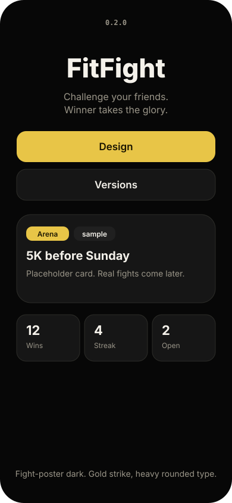
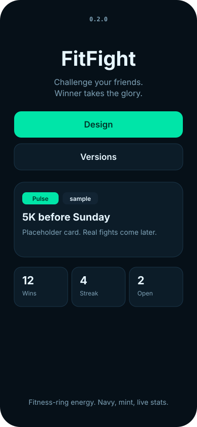
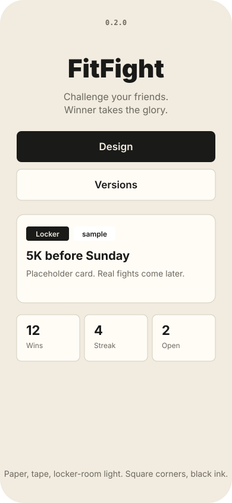
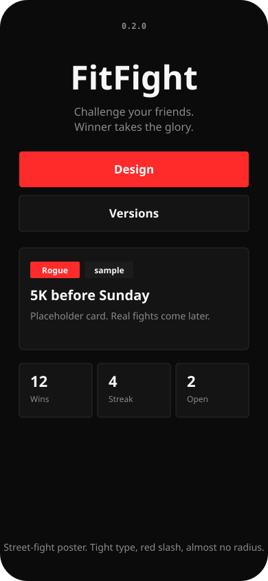

# Design catalog

This is the SwiftUI equivalent of a shadcn kit: tokens, then components, then screens.

**Do not wait on TestFlight to pick a look.** The previews below render on GitHub (including the phone app). `catalog.html` is interactive, but GitHub’s file viewer won’t run it — use [htmlpreview](https://htmlpreview.github.io/) with this file’s GitHub URL if you want the switcher.

Source of truth: [`FitFight/DesignSystem/themes.json`](../../FitFight/DesignSystem/themes.json). After you change it:

```
python3 scripts/render_design_catalog.py
```

The iOS app loads that same JSON. Home + **Design** in the app stay in sync with these previews.

## Arena

Fight-poster dark. Gold strike, heavy rounded type.



## Pulse

Fitness-ring energy. Navy, mint, live stats.



## Locker

Paper, tape, locker-room light. Square corners, black ink.



## Rogue

Street-fight poster. Tight type, red slash, almost no radius.



Version stays at the top of the screen in every theme.
