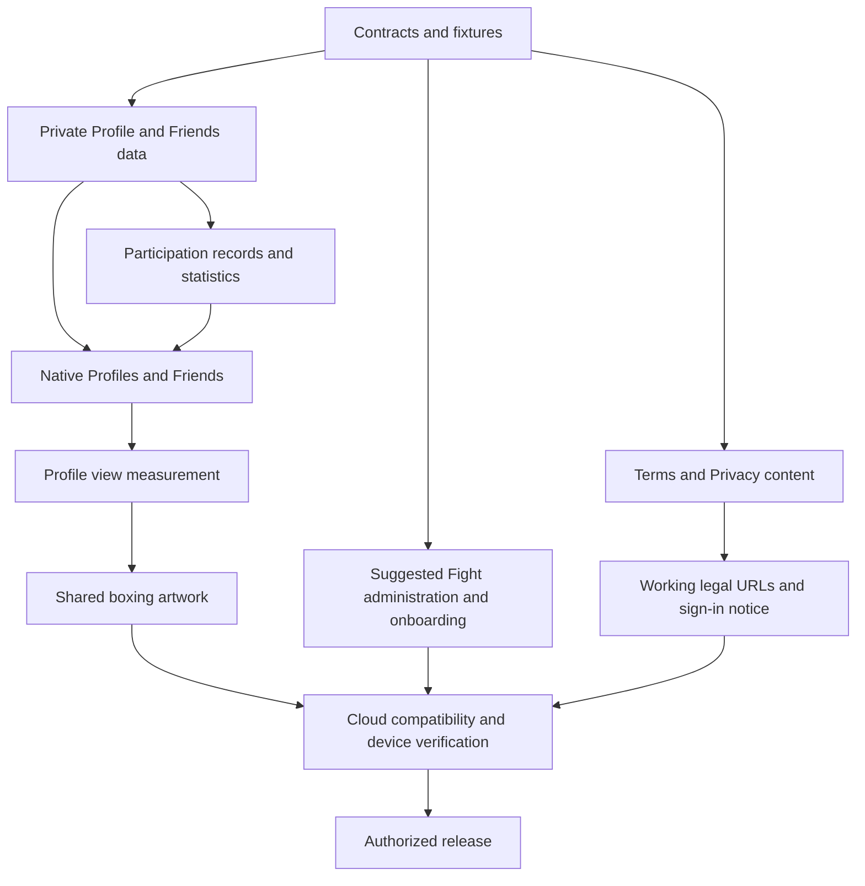

# Profiles, friends, and rivalry implementation plan

Prepared 16 September 2026 from the [agreed proposal](profiles-friends-rivalry-proposal.md), the current repository at `2707eac`, and the read-only release checks below.

Status: core implementation prepared on `profiles-friends-and-stats` on 17 September 2026. Artwork/provider work and Terms/sign-in links are held for missing inputs; cloud verification and deployment status are tracked in [status.md](../status.md#profiles-friends-and-rivalry-implementation-17-sep-2026). This plan does not authorize a PR, branch merge, deployment, paid generation, or App Store submission. Keep the current branch and target `develop` when Marc explicitly requests a PR.

## Implementation checkpoint, 17 September 2026

| Work package | Prepared behavior | Remaining boundary |
| --- | --- | --- |
| Contracts and foundations | Additive v1 routes/fixtures, private sharing/friendship tables, request acceptance and privacy enforcement | Live schema/backend deployment is not authorized |
| Records | Captured departures/final evidence, evidence-limited historical backfill, frozen categories, anonymous tie/field counts after deletion | Old backend drain and actual hosted history coverage must be recorded on deployment |
| Native Profiles | Sheets, owner editing, Friends, record/history, rivalry summaries, challenges, exact-round navigation, explicit Steps-sharing previews | Installed-device accessibility and two-account checks; per-Fight replay choice below |
| Suggestions/admin | Optional final onboarding, real offers/join responses, immutable admin UUID, locked lifecycle changes | Configure the UUID and verify on staging after authorized deployment |
| Measurement | Display-event deduplication, actual friendship/participation attribution, 30-day cleanup, anonymous aggregate retention, operator report | Disabled until Privacy is published |
| Artwork | Private metadata and a disabled preference only | Provider/model, secure credentials, budgets, approved inputs, implementation and real cloud output test |
| Legal | Updated English/French Privacy disclosures | Actual operator/address, jurisdiction and age facts before Terms and native links can be completed |

No feature is live from this branch. The remaining provider/legal inputs are not
assumed defaults. The artwork runner, image delivery, Terms pages and sign-in
notice are not represented as complete. Privacy is prepared for the actual
available behavior, explicitly stating that pair generation is unavailable.

## 1. Outcome and fixed scope

A User can tap another User's avatar or username, open their Profile as a native bottom sheet, request a friendship, view the information that person shares, see their mutual competitive record, and start a Fight or rematch. You becomes the User's own Profile, including editing and Friends.

The release includes:

1. Independent Competitive/Casual and Public/Private Profile controls.
2. Mutually accepted friendships, requests, cancellation, removal, blocking, and reporting.
3. Fights played, Wins, and Win rate, with private/public categories and placement plus field size.
4. Shared Fight history and a viewer-specific Rivalry card.
5. Optional Steps-history sharing with an explicit audience and period.
6. First-party Profile-view measurement and the path from a view to friendship and a shared Fight.
7. A workflow that generates one boxing-glove artwork for a pair and displays the same asset on both Profiles.
8. Marc's public suggested Fights, including optional invitations at the end of onboarding and the existing Fight discovery surfaces.
9. Terms and Privacy links below Sign in with Apple and in You settings.

Completion rate is deferred until withdrawal behavior warrants it. There is no global leaderboard, public website Profile, new tab, new fitness metric, messaging feature, payment feature, or automatic enrollment in suggested Fights. Keep the existing tabs and Feed intact. Keep the version label only at the top of You and Versions permanently under Settings. Future app releases remain `1.1.1` unless Marc changes the marketing version.

## 2. Planning defaults and decisions

These choices make the plan executable without presenting unresolved preferences as approved product decisions. Marc has been asked about the first three; use the working choices below if he does not change them before implementation.

| Decision | Working choice | Effect |
| --- | --- | --- |
| Initial Profile settings | Private and Casual for new and existing Users | Existing history is not silently exposed. Users can enable Competitive and change their audience in Edit profile. |
| Rivalry score | Decided 1v1 Fights only | A group placement is shown in shared history but does not become a fictitious duel win. |
| League meaning | Existing recurring Fight series | No new season or cumulative-league scoring engine. |
| Artwork identities | Existing animal companions wearing boxing gloves | No face processing or profile-photo input in the first implementation. Confirm this before implementing the provider request. |
| Artwork threshold | 10 qualifying visits in one direction within 30 days; at most one per rolling 30 minutes | Five visits in each direction do not add up to ten. Refresh spam does not advance the threshold. |
| Activity sharing | Steps only, Off by default; friends, friends plus current opponents, or all signed-in Users; 7 or 30 days | Sharing remains separate from Profile mode. Public history requires a Public Profile. |
| Profile-view retention | Identifiable events for 30 days, then deletion | Keep aggregate product counts separately without health values or a public named-visitors feature. |
| Friendship notifications | In-app requests list and badge | Do not add new push kinds in this release. |
| Suggested invitation | An offer rendered from the eligible suggested-Fight list | No mass membership insertion, automatic acceptance, or notification blast. |

Hard inputs before the relevant part can go live: the image provider/model and account credentials, spending limit and approved input policy, and the actual service operator/legal details for Terms. Missing image configuration blocks real generation, not the Profile and Friends work. Do not fake a successful job or ship a permanently loading artwork card.

## 3. Repository and live baseline

| Area | Evidence | Implication |
| --- | --- | --- |
| Owner Profile | `FitFight/Profile.swift`, `web/lib/types/profiles/profile.ts`, `profiles-supabase-query.ts` | Keep `/me` compatible. Another User's Profile needs its own deliberately limited response, not the owner response with referral code and custom prompt. |
| Native entry points | `YouView.swift`, `FightDetailView.swift`, `AppModel.swift`, Feed and Feedback author rows | `Person.id` is the stable navigation identity. Wire existing identity controls rather than replacing whole cards' actions. |
| Legacy friendships | `20260824143241_init.sql`, `20260825190000_client_live_steps.sql` | The later insert policy lets a requester insert `accepted`. These rows are not proof of mutual acceptance and cannot unlock the new private Profile. |
| Membership history | `leave-fight-supabase-query.ts`, `update-fight-supabase-query.ts` | Voluntary leaving and owner removal both write `withdrawn`; a departure timestamp and cause cannot reliably be reconstructed. |
| Results | `score-fight.ts`, `recalculate-fight-supabase-query.ts`, `20260911160000_freeze_fight_and_civil_days.sql` | Use final results and coverage, not rank alone. If nobody completes final sync, all ranks can be 1. |
| Suggestions | `suggest-fight-supabase-query.ts`, `join-fight-supabase-query.ts` | Listing already filters public/unpaused series. Enabling Suggested currently lacks the public check. |
| Administration | `is-fitfight-admin.ts`, `update-fight-supabase-query.ts`, `cancel-fight-supabase-query.ts` | Update/cancel are owner-only. The existing admin helper also considers mutable handles and user metadata; do not extend that trust to new admin powers. |
| Existing blocks | `private.feed_blocks`, `private.feedback_blocks` and their query modules | Profile access must honor existing blocks and the new Profile block action consistently. |
| Media | `media-supabase-query.ts` | Existing signed reads last six hours. A revocable pair image needs a separate authorized delivery path. |
| Onboarding | `SessionStore.swift`, `RequestsOnboardingView.swift`, `OnboardingPreviewView.swift` | Bugs & requests is currently the final step; add suggested Fights after it without replaying every step for existing accounts. |
| Terms | `WelcomeView.swift`, `web/app/privacy/page.tsx`, French equivalent | Privacy and Support exist; Terms and the sign-in notice do not. |

Read-only check at **2026-09-16 21:45:58 UTC**:

| Environment | Release endpoint | Latest | Review / internal | Enforcement |
| --- | --- | --- | --- | --- |
| Staging | [app-release](https://staging.fitfight.app/api/app-release) | 1.1.1 build 201 | Both null | Off |
| Production | [app-release](https://fitfight.app/api/app-release) | 1.1.1 build 202 | Both null | On |

These are manifest observations, not installed-device tests or proof of every client's retirement. Staging still needs legacy compatibility while enforcement is off. The production update gate does not revoke direct table access. Preserve the existing build 113 fixture and inspect the relevant released contracts, including previous staging builds 190 and 200, before changing permissions. Recheck both manifests before every deployment.

## 4. Profile access and presentation rules

Implement one shared access decision used by Profile reads, history, view recording, friendship actions, and artwork delivery. Re-evaluate relationships and settings on the server; UI hiding is not authorization.

| Viewer | Basic identity | Competitive record | Activity history | Pair artwork |
| --- | --- | --- | --- | --- |
| Owner | Yes | Own record is available privately; public presentation follows Competitive | Own data | Eligible cards involving the owner |
| Accepted friend | Yes | If Competitive is on | Only explicitly shared metric/period/audience | Only when authorized for both Profiles and both participants allow artwork |
| Current accepted opponent | Yes | If Competitive is on | Only if opponents are in the selected audience | Same pair-permission rule |
| Past opponent only | Yes where already discoverable | Public plus Competitive, or their existing shared Fight result | No continuing private-history access | Only if current permissions allow it |
| Unrelated signed-in User | Minimal identity and request action | Public plus Competitive only | Public Profile plus explicit public activity sharing | Both Profiles and the pair must permit this viewer |
| Blocked, deleted, or signed out | No new Profile access | No | No | No |

Current opponents means two accepted members of the same live Fight or its final-sync grace period. An invitation, a deferred next-round entry, or a future scheduled Fight does not grant history access early. Existing shared Fight standings remain available under their existing contract; blocking the expanded Profile does not rewrite an agreed result.

- A private Profile remains identifiable enough to request a friendship. Do not publish extended statistics or a friends roster through lookup.
- Competitive off hides Profile statistics, rivalry scores, and boxing artwork from other Users. It does not erase results, alter scoring, or reset the record when re-enabled.
- Private history rows show only that Profile owner's outcome, placement, field size, and timing. Do not disclose other participants, private titles, loser actions, posts, or an unauthorized detail link.
- A Steps-history request is capped by the owner's chosen period and audience. A caller cannot request a longer period to override it. Use stored merged Steps days with their time zone, coverage, and freshness; missing days are unknown, not zero. Do not add overlapping Fight totals to fabricate a daily chart.
- Start with existing stored data. Do not broaden HealthKit collection or add retrospective uploads in this work. Display the real coverage window when fewer than 7 or 30 days are available.
- Profile blocks override friendship/publicity for these new surfaces in either direction. A new Profile block cancels pending friendship activity and suppresses pair artwork. Existing Feed/Feedback block behavior must be honored; keep this integration limited to affected access and block paths.
- Responses use private, non-shared caching. Clear native Profile/history/artwork state on sign-out, account switch, block, and setting changes; reauthorize on reopening or foregrounding. Never use previously cached private content as a network-error fallback.

## 5. Competitive statistics and reliable history

Use a small server-owned result module whose public interface produces a Profile record and a pair comparison from verified participation/result facts. Query functions load those facts; routes and Swift views do not recompute wins.

Working rules to lock in fixtures before coding:

| Case | Fights played / win-rate denominator | Win credit |
| --- | --- | --- |
| Final Fight, at least two real entrants, verified result | One | One for an unambiguous first-place result with valid final coverage |
| Shared first place | One | Zero; show a draw/shared first in history |
| One participant misses final sync | One | Preserve the actual final forfeit/result; incomplete data is not called quitting |
| Nobody supplies complete final data | One | Zero; draw, never a win inferred from rank 1 |
| Voluntary withdrawal after participating in the active window | One once the Fight resolves | Zero; quitting cannot remove the denominator entry |
| Declined invite, deferred round not entered, or withdrawal before the start | Zero | Zero |
| Owner/admin removal | Exclude that removed membership from the ratio and label it Removed | Never call removal a voluntary forfeit |
| Cancelled Fight, ongoing Fight, solo Fight, or unclassifiable legacy result | Excluded from the scored denominator | No inferred win; retain appropriately labelled history |

Win rate = wins divided by scored Fights played, rounded only for display. With no eligible results show "No results yet", not 0%. A caption explains excluded historical results. A round in a recurring series counts once. Keep raw counts alongside the percentage.

Freeze the private/public category at the start of each round and its real entrant count from participation facts. A later series visibility edit must not move old wins between categories. A duel is a round with exactly two real entrants; a group reduced to two by removals is still a group.

Capture participation, voluntary departure, owner removal, and finalization in the same transactions as the affected domain mutations. Serialize against the Fight and relevant memberships using the existing finalization lock order. Preserve the result after a User leaves a recurring series or after their final membership state changes. Do not change the current scoring rules as part of this feature.

For old data:

1. Backfill only facts supported by frozen results, snapshots, and membership evidence.
2. Do not invent departure times, removal reasons, or the old public/private category from today's series settings.
3. Label uncertain rows Historical result unavailable or Category unknown; show verifiable overall results without falsely splitting them.
4. Do not promise a complete lifetime win rate where the evidence is incomplete. Record backfill coverage and the point from which the ledger is complete.
5. During overlap with old writers/backends, reconcile possible missed records and mark uncertain intervals. Full-fidelity capture starts only after the new backend mutation paths are in service and old instances have drained. New friendship-based Profile access never relies on legacy `public.friendships` rows.

The Rivalry card shows the pair's 1v1 wins, losses, and draws. Show "No head-to-head results yet" when appropriate. Another person's Profile shows Fights together, including groups, only while both people remain members of the round and its series. This list remains available independently of Competitive/Public settings. Historical competitive totals survive departure. Challenge opens the existing composer with the opponent selected.

The standalone Rivalry Rematch button was removed on 18 Sep. A replacement new-week action must belong to a specific finished or cancelled Fight. Creation is pending the product choice between another round in the original series and a separate Fight with the same setup.

## 6. Data and module layout

Keep new permission-sensitive data in the unexposed `private` schema, with explicit grants, RLS, and no app-role write access. Reuse existing identity and scoring storage. Preserve the legacy public tables for supported clients rather than making their weak writes authoritative for new permissions. Grants and RLS both need verification, as described in [Supabase's RLS guide](https://supabase.com/docs/guides/database/postgres/row-level-security).

| Storage concern | Planned representation | Essential constraint |
| --- | --- | --- |
| Profile settings | `private.profile_settings` keyed by User | Competitive, audience, Steps-sharing period/audience, artwork preference, settings revision; safe defaults when absent |
| New friendships | `private.profile_friendships` with canonical unordered pair and requester | One pair; only the other participant can accept; no legacy accepted-row import |
| Blocking/reporting | Profile block/report rows plus the existing Feed/Feedback block checks | Involved parties only; report delivery uses existing operator tooling, not a new public board |
| Fight record | Private Fight context plus member records | Unique Fight/User result, frozen category, participant provenance, departure cause, result completeness/version |
| View/product events | `private.profile_events` | Verified actor, target, event ID, allowlisted source, server time; unique actor/event ID; no health payloads |
| Rivalry artwork and work state | `private.rivalry_artworks` | One unordered pair/art version, job state, provider request ID, settings/input revision, private object path, hide state |

Do not build an analytics warehouse or a separate generic queue framework. A rivalry row can hold both its generation state and resulting asset metadata. Do not generate new revisions merely because a User edits their companion; regeneration is a later explicit product decision.

Put new Zod schemas and inferred types under `web/lib/types/profiles/`, `friends/`, and `rivalries/`. Keep all database calls, including raw SQL, in domain-focused files under `web/lib/supabase/queries/`. Pure access/result decisions live in focused domain modules. Use the existing `apiRoute`, `readJson`, and `ApiError` flow. Keep each operation deep and readable; do not create a helper for each comparison or one-line mapping. No app-facing Postgres RPCs.

Create additive migrations with the installed Supabase CLI's migration command. No hosted reset/push, destructive cleanup, hand-edited generated types, or simultaneous direct-client permission cutoff. Update account deletion to remove friendships, settings, events, reports, records, and every pair image involving the deleted User, including work owned by the other participant.

## 7. Native interfaces and backend contracts

Use `/api/v1`. Exact field names are finalized with shared fixtures, but responsibilities are fixed:

| Operation | Planned endpoint | Contract |
| --- | --- | --- |
| Read another Profile | `GET /profiles/{userID}` | Safe identity, access state, friend state, permitted summary, pair comparison, artwork metadata; no owner-only fields |
| Paginated history | `GET /profiles/{userID}/history` | Only authorized, redacted rows with stable pagination |
| Read/write own settings | `GET/PATCH /me/profile-settings` | Partial updates preserve omitted settings and old clients; validate audience and period once |
| Exact-username lookup | `GET /profiles/lookup?handle=...` | Minimal identity, rate limited; no user-directory feature |
| Friends and requests | `GET /friends` | Paginated accepted, incoming, and outgoing relationships |
| Request/respond/remove | `POST /friends/{userID}/request`, `POST /friends/{userID}/respond`, `DELETE /friends/{userID}` | Idempotent authorized transitions, self-request rejection, pair lock; reverse pending request is presented for acceptance |
| Block/report | Profile block and report routes | Reuse existing response conventions and moderation delivery; never let a caller select the reporter identity |
| Record a displayed Profile | `POST /profiles/{userID}/views` | Validated source and event ID; actor/time from server; access rechecked; no GET side effects |
| Read/hide pair art | Authorized pair-image read and hide routes | Recheck both Profiles and participant permissions; no public object path |
| Admin suggestion/lifecycle | Existing suggested route plus narrowly scoped admin Fight operations | Server-owned admin identity, public-only suggestion, supported lifecycle actions, audited changes |
| Process artwork | Protected `/api/internal/rivalry-artworks` | Bounded job processing with server credentials; no mobile access |

The displayed-Profile response distinguishes Hidden/Private from empty statistics. Hidden content is never sent for the client to conceal. Keep view tracking off the critical read path; its failure cannot prevent reading an allowed Profile. Only record successful visible presentation, not prefetches, canceled sheet openings, previews, self-views, or a privacy lock screen.

Native work:

- Add a Profile sheet and focused state model that fetch by UUID, cancel stale reads when switching people, and clear data across accounts. Register new Swift files explicitly in `FitFight.xcodeproj/project.pbxproj`.
- Reuse the existing bottom-sheet motion, drag dismissal, spacing, Nunito, 22pt cards, hairlines, and Night/Day tokens. Respect Reduce Motion, Dynamic Type, VoiceOver, and 44pt touch targets. Gold remains progress-only; Add friend uses the existing primary action treatment.
- You gets Edit profile, the owner's record, Friends with incoming requests, and eligible rivalry cards. Move existing editing into the editor without removing Apple Health, Companion, Feedback, Settings, Look, Versions, or deletion.
- Editor contains the two Profile controls and the separate optional sharing preferences, with a read-only preview of the exact audience projection. The preview performs no analytics or generation writes.
- Wire identity taps in standings, Fight participants, Feed posts/comments/reactions, Feedback authors where a stable ID exists, Friends, and exact-username lookup. Add optional author IDs to affected older response shapes only if needed; preserve existing contracts and gesture actions.
- Friend buttons represent Add friend, Requested, Accept/Decline, and Friends. Failed mutations restore the confirmed state and show an actionable error. Unfriending revokes friend-only access immediately on subsequent reads.
- Challenge and Rematch use the existing composer. Do not add duplicate Fight creation logic or a new scoring mode.
- Add English/French strings and one `1.1.1` ReleaseNote for the eventual user-facing ship. The generic app version line remains only at the top of You.

## 8. View measurement and the boxing-artwork workflow

Measure total valid opens, unique viewers, repeat qualifying visits, requests sent, requests accepted, and subsequent shared Fight participation. Use actual server-side friendship/join transitions for conversion events. Suggested attribution is the most recent Profile visit in the preceding seven days; report that definition with the counts. Do not confuse these product metrics with a User's win rate.

The native client sends a random event ID once per displayed sheet and an allowlisted entry point. The backend derives the actor from authentication, assigns the timestamp, checks current access/blocking, and deduplicates the event. Client timestamps, actor IDs, counters, and claims about being friends never determine eligibility. Apply bounded per-actor write limits and index actor/target/time for the rolling-window query.

Raw analytics are internal, not a list of named visitors on another person's Profile. Keep health values, photos, custom companion descriptions, tokens, and free-form text out of analytics. Disclose the collection in Privacy. Run scheduled retention cleanup even for inactive Users and delete actor/target events on account deletion. The admin readout is an authenticated aggregate report through existing operator tooling, not a new analytics dashboard.

Generation sequence:

1. In the view-write transaction, lock the canonical pair and update the qualifying-visit state. At the threshold, verify both Users are Competitive, have allowed pair artwork and relevant external processing, and are not blocked or deleted.
2. Insert the pair/art-version job using a unique constraint. A reverse-direction threshold or concurrent tenth visit returns the same job. Do not create another paid job on every subsequent view.
3. A protected cloud runner claims a bounded batch, commits the claim, then performs provider work outside the database transaction. Reuse the existing scheduled internal-route pattern and row-lock claim approach; keep image work separate from notification delivery and Profile-response latency.
4. Snapshot the approved visual inputs and settings revisions. The planned input is two animal companions in friendly 1v1 boxing poses, both wearing gloves, using the app's established illustration style. Supply only the visual inputs the Users agreed to share, not usernames, view counts, scores, health data, or an entire Profile payload.
5. Use the configured provider's documented request/job identity and idempotency behavior. Persist the provider request ID. Confirm the provider's duration fits the cloud execution window; if generation is asynchronous, submit and poll in separate bounded runner invocations. Do not add a new hosting service speculatively.
6. Validate the returned image's media type, dimensions, and size, then store one object in private storage. Do not append a new artwork purpose to existing media responses consumed by older builds. Give the new Profile contract its own artwork representation.
7. Recheck both participants' settings, revisions, block state, and deletion state before publishing. If permission changed during generation, suppress publication and remove an unusable output. Only mark Ready once the verified object exists.
8. Both Profiles reference that same asset. The pair can appear in the owner's Rivalry area and in an authorized visitor's contextual Rivalry card. A viewer must be permitted to see both identities and their pair artwork; a public Profile cannot reveal its private rival to an unrelated viewer.
9. Deliver image bytes through a server-authorized read with private/no-store caching, rather than the existing six-hour bearer URL. Apply the same access checks to the image route as to the Profile response. Client caches must be scoped and cleared with access changes. Already viewed or captured images cannot be retroactively recalled.
10. Either participant can hide the pair artwork. Blocking, disabling Competitive, changing sharing, or deleting either account immediately stops new authorized delivery and cancels queued work. Hiding must not re-enqueue generation on the next threshold check.

Work states: Queued, Generating, Ready, Failed, Needs review, and Cancelled. An ambiguous provider timeout or crash after submission goes to Needs review and is reconciled by provider request ID where supported; do not blindly resubmit a possibly charged request. One pair/art-version permits at most one automatic paid submission. A confirmed failed job does not show a broken card or a permanent spinner.

Configure generation separately for staging and production, with a hard per-image/per-day spending limit and an operator disable switch. No configured provider means no paid work and no false success UI. Activation requires a real disposable-pair cloud test, visual inspection of both recognizable companions and their gloves, and proof that both Profiles load the same artifact. Test doubles cover failure behavior but do not count as a working provider integration.

Storage uses a private bucket with no mobile direct access. Supabase supports authorized downloads and time-limited signed URLs; the selected delivery approach preserves a current application access check instead of relying on a long-lived URL. See [Supabase private downloads](https://supabase.com/docs/guides/storage/serving/downloads).

## 9. Suggested Fights, admin controls, and onboarding

Treat Suggested, Public/Private, and Recurring as distinct settings. "Everybody on the app" is an ordinary named series with those settings, not a special global leaderboard or an automatic membership.

Backend changes:

- Restrict new administrative mutations to Marc's immutable, server-configured Auth User identity. Never trust a caller-supplied admin flag, mutable handle, or user-editable metadata email. Update the suggestion authorization path to use that same trustworthy check; do not broaden unrelated admin features.
- Enable Suggested only for a public, unpaused, eligible series. Disabling Suggested is allowed even if a series has become ineligible.
- Serialize suggestion, visibility, pause/cancel, and join changes against the same series/Fight. After a concurrent private conversion and suggestion request, private plus suggested must never persist.
- Clear Suggested when a series becomes private or is stopped. Returning it to public does not restore Suggested without Marc selecting it again.
- Preserve old edit payloads. If supported direct/old-server writes can change visibility without clearing Suggested, a small internal invariant trigger may clear the flag. Keep authorization and lifecycle decisions in TypeScript and verify the legacy write paths; do not introduce a constraint that simply rejects previously valid private edits.
- Add only the requested admin powers: change visibility, toggle recurrence, remove from Suggested, and stop/cancel an eligible round or pause future rounds. Cancellation preserves history and finalized results; "kill" does not mean delete accounts, scores, or a database table.
- Reuse existing join timing, capacity, recurring-round, and membership rules. A suggestion is never authorization to bypass them.

Native changes:

- Marc sees those controls only after server-confirmed admin capability. Present Stop current round and Stop future rounds clearly when both apply, with the existing destructive-action confirmation treatment.
- Reuse the eligible suggestions in New and the Fights invitation area as optional offers, without manufacturing `invited` memberships or a new legacy Fight-state enum.
- Append a Suggested Fights step after Bugs & requests. Load the same server list and show title, current participants, duration/timing, basic rules, and the sharing reminder. Each card offers Join and then confirms membership using the actual response. An existing member sees Joined.
- A Skip action completes onboarding. No eligible suggestions means finish immediately; a loading failure offers retry or continue. A suggestion becoming private/ended before Join returns its normal unavailable state and refreshes the list.
- Existing Users are not forced through old onboarding again. They discover suggestions in New/Fights. Extend Replay onboarding for Marc to cover the new final sheet.
- Joining through suggestions does not change the User's Public or Competitive setting. A public Fight's participants see the accepted Fight data regardless of whether the Profile is Casual.

## 10. Terms, Privacy, and sign-in copy

Implement the exact agreed flow:

> By continuing, you agree to FitFight's Terms of Service and acknowledge its Privacy Policy.

- Put it directly below Sign in with Apple, readable at large text sizes. Terms of Service and Privacy Policy are separate accessible links, available before authentication.
- No checkbox, Agree button, Terms-acceptance screen, acceptance-record table/requirement, or agreement gate for existing signed-in Users. Keep Apple authentication and the current onboarding sequence apart from the new final suggestions step.
- Add `/terms` and `/fr/terms` using the existing legal-page layout. Link them from You settings and the relevant legal navigation. This is a legal page only, not authorization for a broader website.
- Draft accurate English and French Terms using the real operator/contact and reviewed account, Fight, social-content, moderation, informal loser-action, suspension, deletion, and fitness-service wording. Obtain the outstanding operator/jurisdiction/age facts before publishing; do not ship placeholders or claim a generic draft guarantees enforceability.
- Update both Privacy translations to describe Profile audiences, activity-history settings, first-party view measurement/retention, and the actual artwork provider and inputs. Optional health/history or external image-processing choices remain specific to those features. The sign-in notice does not enable them.
- Deploy working legal URLs before distributing a build that links them. Update App Store disclosures/review notes to match actual behavior when the new release is prepared, without assuming the previous submission covers it.

The sign-in notice is a recorded product decision. Do not reintroduce a separate Terms agreement while implementing optional sharing choices elsewhere.

## 11. Work packages and dependency order

These are implementation increments, not automatically authorized PRs. Each includes its relevant tests and docs. Keep unrelated cleanup out of every increment.

| Order | Work package | Main files/areas | Done when |
| --- | --- | --- | --- |
| 1 | Contracts and fixtures | `web/lib/types/`, `contracts/openapi.yaml`, `contracts/fixtures/`, this plan | Access matrix, statistics cases, transition outcomes, and old/new request examples are explicit; remaining product choices are resolved or visibly held. |
| 2 | Profile/Friends foundations | Additive migrations; Profile/Friends query and domain modules; `/api/v1` routes | Mutual acceptance is server-controlled; private fields cannot be fetched or directly written by another User; four mode combinations pass. |
| 3 | Participation records and stats | Leave/update/join/accept/finalize paths; result module; backfill tool | Accurate forward records, evidence-limited history, immutable result categories, and no win inflation from ties/incomplete sync. |
| 4 | Native Profiles and Friends | `YouView.swift`, Profile sheet/editor/state, `FitFightAPI.swift`, identity rows, project file | All supported identity entry points open the right Profile; friends and rematches work; access and loading states are correct. |
| 5 | Suggested offers and admin | Suggest/update/cancel/join query paths, admin identity, New/Fights, onboarding/session/preview | Only eligible public Fights are suggested; races are safe; Join is optional and real; old onboarding is not replayed. |
| 6 | View measurement | View route, private event storage, UI presentation hook, server transition events | Opens are deduplicated, source attribution is inspectable, retention runs, and counts match the test scenario. |
| 7 | Artwork workflow | Pair/job storage, internal runner, provider module, private delivery, Profile cards | One threshold yields one real image shared by both Profiles; concurrent/reverse events do not duplicate charges; revocation and failure checks pass. |
| 8 | Legal pages and sign-in notice | `WelcomeView.swift`, `YouView.swift`, English/French legal pages and localizations | Real Terms/Privacy URLs work before sign-in; notice-only flow matches Marc's decision; published text matches enabled features. |
| 9 | Cloud validation and release evidence | Existing CI, cloud rehearsal, `docs/status.md`, `Changelog.swift`, App Store disclosures | Compatible schema/backend/app order is proven; every required scenario below passes or is explicitly held with the dependent feature disabled. |

Packages 3 and 4 depend on 2. Package 5 and legal drafting can proceed independently after their contracts are fixed. Package 6 needs the Profile path from 2/4; 7 needs 6 plus sharing/relationship access. Package 8 must be deployed before the corresponding native links ship. Full feature completion includes a real provider test, not only enqueue logic.

## 12. Verification plan

Test the public operation interfaces and user-visible rules, not a mirror of helper implementations.

| Area | Required cases |
| --- | --- |
| Access | Owner/friend/current opponent/past opponent/stranger; all four mode combinations; independent activity audience/period; either-direction block; account deletion; unauthorized image/history reads; no owner-only data in public DTOs. |
| Friendships | Self request, duplicate/reverse simultaneous request, recipient-only accept/decline, cancel, remove, re-request policy, block during acceptance, and proof that a legacy client-created accepted row grants no private access. |
| Results | Zero history; 10 played/3 wins = 30%; tie; all incomplete; partial forfeit; withdrawn before/after start; owner removal; solo; cancelled; ongoing; recurring rounds; group reduced to two; unknown historical category; visibility edited after finalization. |
| Concurrent writes | Leave versus finalization; owner removal versus sync; settings/block versus Profile/image read; private conversion versus suggestion/join; backfill versus new results. |
| Analytics | Prefetch/self/failed/locked views excluded; event replay; qualifying rolling window; reverse direction; server timestamp; attribution definitions; cleanup for inactive and deleted Users. |
| Artwork | Concurrent threshold crossings; both directions; disabled provider/budget; unsupported custom input; provider failure or ambiguous timeout; crash after submission/storage; privacy change before publication; one shared asset; hide/block/delete prevents new delivery. |
| Suggestions | Non-admin denied even with spoofed user metadata/handle; private cannot be suggested; public-to-private clears it; paused/final/ended unavailable; delayed Join rechecks; already joined; recurrence; safe stop versus final-history preservation. |
| Native UX | All entry points; fast switching between Profiles; slow/offline/error/retry; no private stale-cache fallback; account switch; friend state changes; sheet dismissal; empty artwork; Dynamic Type, VoiceOver, Reduce Motion, Night/Day, English/French. |
| Onboarding/legal | Links usable signed out; no extra Terms acceptance; suggestions last; empty/error list skippable; no repeated onboarding for existing Users; no automatic joining or sharing changes. |

Implementation checks:

- From `web/`: `npm run typecheck` and relevant tests after each TypeScript increment; full `npm test` for the shared access/scoring/admin changes. Add new test paths to `web/package.json` only if the existing globs do not cover them.
- Run `npm run test:legacy-113` and `npm run test:database` against a migrated disposable cloud database using the current CI setup. Add authenticated HTTP cases and direct-table forbidden-read/write cases. Test both current grants and the separately deferred cutoff; never activate that cutoff as part of this plan without its own rollout proof.
- Cloud migration checks: `scripts/forbid-destructive-sql.py`, schema lint, pgTAP, transaction tests, and a disposable-cloud backfill rehearsal with before/after counts and privacy assertions. Never reset a hosted production/develop database.
- Preserve existing `profile.json`, Fight snapshot, joinable, and legacy fixtures. Add new fixtures instead of replacing old examples to make a breaking change pass. Verify build 201/202 decoding and earlier admitted staging contracts.
- GitHub-hosted `macos-26`: simulator compilation, existing native state/contract tests, new Profile/Friends/presentation state tests, localization check, and token equality. Register new native test files and project source entries explicitly. No workstation Xcode build.
- Exercise the legal routes in running Next.js and verify both languages, links, keyboard navigation, and narrow-screen layout. No new framework or dependency is necessary for these pages.
- Test with two staging accounts and two installed clients: request/accept, toggle access, inspect each other's record, join a suggested Fight, trigger the controlled artwork test, hide/block, and delete a disposable account. A successful HTTP test is not a substitute for this installed-device evidence.
- Before enabling public artwork, verify the chosen model output visually and confirm credentials, budgets, retention, and provider disclosure are configured for that environment. Keep secrets out of source, app, screenshots, and reports.

The criteria above remain the acceptance checklist. Implementation has cloud tests; passing runs, limitations, held provider/legal work, and unperformed installed-device checks are recorded separately in [status.md](../status.md#profiles-friends-and-rivalry-implementation-17-sep-2026). A compiled app is not evidence of a completed real-provider or installed-device test.

## 13. Compatible deployment and rollback

1. Re-read `docs/shipping.md` and both live release manifests. Capture supported builds, old routes/direct-table behavior, and deployed migration/backend versions. Resolve the remaining product/provider/legal inputs for the work being shipped.
2. Apply additive schema and indexes to the disposable cloud database first, then rehearse backfill and compatibility. New privacy data stays inaccessible to app roles. Keep current `/me`, Fight, feed, media, and join responses stable for installed clients.
3. When Marc authorizes staging integration, deploy compatible schema and backend before native distribution. Keep expanded sharing off until Users choose it. Run backfill only with verified evidence and reconcile concurrent writes; record historical coverage and backend drain time.
4. Verify staging with the actual admitted builds. A new build uploaded for Marc is not proof that Friends Beta can install it. Do not remove legacy grants or behavior in the expansion migration.
5. Publish the reviewed legal content and check its live URLs. Enable staged generation only after credentials, budget, disclosures, and one real end-to-end pair test are verified.
6. When Marc asks for a TestFlight release, merge the tested `develop` changes to `preview`. CI uploads staging; Marc opens TestFlight and updates. Agents do not dispatch workflows or promise an upload from a feature/develop push.
7. Only when Marc requests production, merge `preview` to `main` and follow the schema/backend-first sequence there. Recheck production permissions, contract fixtures, legal URLs, and separate generation configuration. Do not infer production readiness from staging.
8. Keep final app submission/release separate and explicitly authorized. Record code checks, cloud checks, live deployments, admitted builds, installed-device evidence, and remaining limitations separately in `docs/status.md`.

Rollback is additive: disable new generation first, stop new jobs, hide unfinished new surfaces if needed, and roll back to a compatible backend/app behavior while retaining the safe new tables. Never reopen private access, undo consent choices, erase Fight history, or reset databases as a rollback. In-flight image work must recheck settings even after the runner is disabled. Previously authorized copies cannot be recalled, but new delivery must stop.

## 14. Final completion criteria

- Profiles, Friends, records, Rivalry, sharing, and suggested invitations work through native screens with real authenticated backend state.
- Mode changes and blocks control actual server responses and image delivery. Private Fight details remain private, including through statistics, old tables, and cached objects.
- Completion rate and a global leaderboard are absent. Existing Fight scoring and supported clients still behave correctly.
- One qualifying pair receives one real boxing image, both fighters wear gloves, and both Profiles use the same stored asset under their permissions.
- Signup shows only the agreed Terms/Privacy notice, with working pages and no extra Terms agreement flow.
- Cloud and native checks pass; live and device checks are separately documented. The release sequence respects Marc's explicit PR/merge/production instructions.

Planning deliverables: this implementation plan, the linked product proposal, the terminology already recorded in `CONTEXT.md`, and the dated release-manifest baseline in `docs/status.md`. Notion has not been updated by this planning work.
