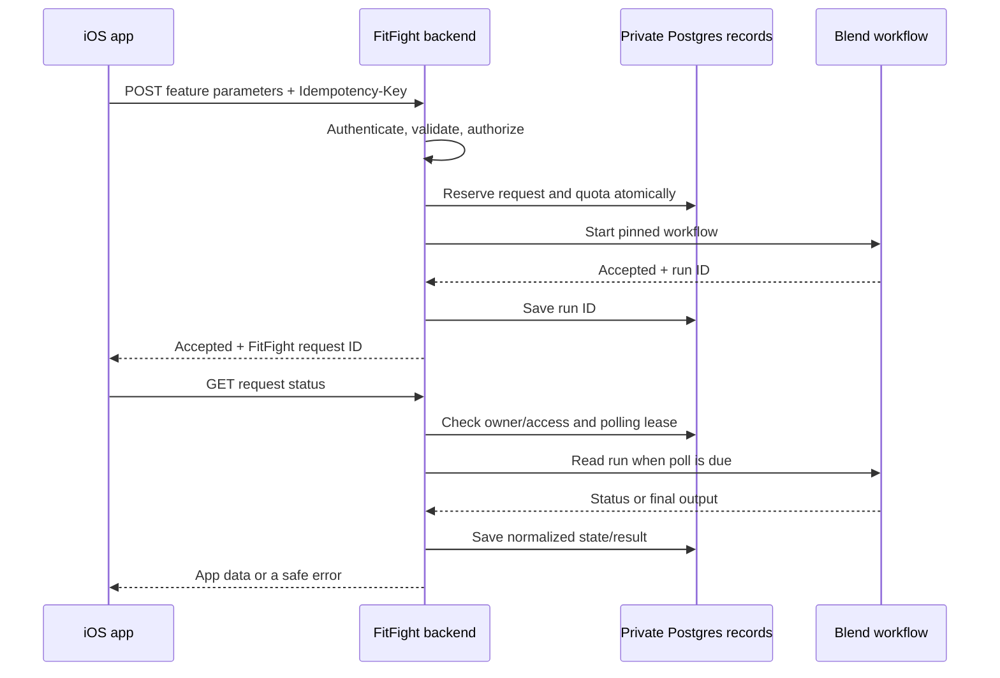

# Reusable Blend workflows in FitFight

Implementation prepared on 17 Sep 2026: see [Blend workflow requests](../blend-workflows.md). The first caller uses the existing published Avatar workflow; recap migration and its health-sharing decision remain separate.


17 Sep 2026. **Proposal only.** No application code, credentials, database, or deployment changed.

Use a small server-only TypeScript module with two functions: **start a named workflow** and **read its result**. The app sends ordinary feature parameters to FitFight. FitFight authenticates the user, checks access and limits, and calls Blend. Prompts, models, execution history, and AI diagnostics stay in Blend.

I recommend plain functions, with shared configuration inside the module. A class does not add useful behavior here. Adding another workflow should require its input/output contract and published version, plus the feature's authorization, without repeating provider HTTP or error handling.

Assumption: this is for the FitFight backend in this workspace. Daily recaps are a concrete example because an implementation already exists; this proposal does not authorize enabling them or adding a new recap screen.

## What the documentation establishes

The supplied `docs.tyblend.ai` did not resolve. The working Blend documentation is [docs.tryblend.ai](https://docs.tryblend.ai/introduction).

| Verified behavior | Design consequence |
| --- | --- |
| `POST https://tryblend.ai/api/v1/responses` accepts `workflowId`, optional `versionId`, `inputs`, and `stream`. With `stream: false`, it returns HTTP 202 and `run_id`. | Starting a run does not return its completed result. [Start a response](https://docs.tryblend.ai/endpoint/start-a-response) |
| `GET /api/v1/runs/{runId}` returns pending, running, completed, failed, or cancelled state. | The module needs a read operation; the app can resume checking the same run. [Get a run](https://docs.tryblend.ai/endpoint/get-a-run) |
| Authentication uses a server API key. Rate limits are per key, with remaining/reset headers and `Retry-After` on 429. The actual allowance is not specified. | Keep the key on the server and coordinate starts and polling across instances. [Authentication](https://docs.tryblend.ai/api-reference/authentication) |
| Published versions are immutable; omitting `versionId` selects the latest published version. | Pin a tested version in each environment. [Publishing](https://docs.tryblend.ai/workflow/review-and-publish), [start parameters](https://docs.tryblend.ai/endpoint/start-a-response) |
| Output is keyed by User Result label, with arrays of items containing typed parts. Items can fail independently. | Decode the expected result and validate its contents; HTTP 200 or a completed run alone is insufficient. [Output parts](https://docs.tryblend.ai/parts) |
| Reposting after a disconnected stream starts another billable run. | Resume a known run; never automatically repeat an uncertain start. [Streaming](https://docs.tryblend.ai/api-reference/streaming) |

The documented API has three endpoints: start, read, and stream. I found no documented start-idempotency key, cancellation endpoint, callback/webhook, or caller metadata field. Do not invent those capabilities. A timed-out start without a run ID is the main remaining reliability gap. [API overview](https://docs.tryblend.ai/api-reference/overview), [OpenAPI contract](https://docs.tryblend.ai/openapi.json)

## Shape of the implementation



The reusable module's interface would look like this. These names describe proposed server calls, not existing Blend SDK methods:

```ts
const run = await startBlendWorkflow("daily_status", context);
const result = await readBlendWorkflowRun(run);
```

`context` is the validated, server-derived feature input. The workflow name determines its TypeScript input and result types. Callers cannot substitute a URL, API key, model, prompt template, arbitrary workflow ID, or output schema. Inject the HTTP transport for tests; use native `fetch` in production.

The saved run handle includes its workflow alias, selected version, and Blend run ID. Reads use that version's decoder, including after a deployment changes the version selected for new starts. Retain decoders while their runs remain readable. Blend does not require every response to echo the workflow/version IDs, so preserve the selected configuration locally. [Response schema](https://docs.tryblend.ai/openapi.json)

The module owns HTTPS requests, server configuration, pinned workflow selection, short HTTP deadlines, Blend envelope validation, expected output extraction, and normalization of upstream failures. The feature owns who may run it and which application data it may receive. Admission and metering sit above the Blend module and are shared by app commands and any scheduled caller.

Suggested initial file placement:

| Location | Responsibility |
| --- | --- |
| `web/lib/blend/client.ts` | The two exported functions and private HTTP/error handling |
| `web/lib/blend/workflows.ts` | Server-owned workflow definitions: published ID/version, input mapping, result label, decoder |
| `web/lib/types/blend/` | Zod schemas for configuration, upstream envelopes, and inferred types |
| `web/lib/types/ai/` | App request/status/error schemas and inferred types |
| `web/lib/domain/ai/` | Admission and status coordination, shared by the HTTP entry points |
| `web/lib/supabase/queries/ai-requests-supabase-query.ts` | All SQL for ownership, reservations, quotas, and polling leases |
| `web/app/api/v1/ai/runs/` | Thin authenticated start and status routes |
| `supabase/migrations/` | An additive migration for private operational records |

Use the installed Zod 3 conventions and existing `apiRoute`, `readJson`, `verifyUser`, and database client. Keep each flow readable; do not scaffold a provider framework or a separate service. [Current dependencies](../../web/package.json), [HTTP helpers](../../web/lib/http.ts), [database client](../../web/lib/supabase/postgres.ts)

## What the app sends and receives

A concrete proposed command, if an on-demand recap becomes the first approved caller:

```http
POST /api/v1/ai/runs
Authorization: Bearer <FitFight session>
Idempotency-Key: <UUID for this user action>
Content-Type: application/json

{
    "workflow": "daily_status",
    "parameters": {
        "fight_id": "<fight UUID>",
        "locale": "en"
    }
}
```

Only allowlisted feature names exist. Validate each feature's parameters strictly and limit body size. Derive identity from the verified session and Fight context from authorized database reads. The app cannot provide another user's identity, standings, quota, or Blend configuration.

Return HTTP 202 with `request_id`, `status: "pending"`, and `poll_after_seconds`. The app reads `GET /api/v1/ai/runs/{request_id}`. That endpoint verifies both ownership and current resource access on every read, including cached results. Blend's account-level ownership is insufficient because all FitFight users share the backend credential.

Status responses contain the FitFight request ID and one of `pending`, `running`, `completed`, `failed`, `cancelled`, or `start_unconfirmed`. Completed responses contain feature data, for example `{ "alert": "...", "recap": "..." }`. Terminal failures contain the safe `code` and `error` fields described below. A successful status lookup can therefore return HTTP 200 with `status: "failed"`; the app must handle the state as well as the HTTP code.

Start with polling and an ordinary loading state. Persist the request ID and action key on the phone so foregrounding or reopening resumes the same request. Stop polling when the screen is inactive or the run is terminal. After a proposed 60-second visible wait, show "Still working" with a way to check again. That is a UI deadline, not evidence that Blend stopped. Closing the screen also does not cancel a run.

Use a short per-call HTTP timeout, provisionally 10 seconds. A failed status read can be retried later against the same run. A start timeout takes the separate uncertain-start path below. Confirm the final values against staging latency and hosting limits before enabling the feature.

## Minimal metering and duplicate prevention

Blend remains the place to inspect prompts, model calls, tokens, cost, and execution history. FitFight needs a small **operational request record** for authorization, quotas, and safe resumption. This is not an AI analytics dashboard.

Proposed fields: request ID, owner ID, workflow alias, resource ID, idempotency key, canonical client-parameter hash, selected workflow/version IDs, nullable Blend run ID, state, timestamps, polling lease, and a sanitized failure code. Store the validated app result only when it is needed for repeat reads; reuse existing feature storage where suitable. Do not copy prompts, raw inputs, raw provider errors, or model traces. Cascade user deletion and define a short retention period before launch, provisionally seven days for terminal request records and their idempotency keys. Never delete unresolved requests merely because their last read is old.

For a first rollout, propose **3 start attempts per minute and 20 per UTC day per user**, shared across AI features, plus **one unresolved run per user**. These are product defaults for discussion, not Blend limits. Also require an environment-wide daily start cap and concurrent-run cap selected after measuring the chosen workflow. Bound each workflow's inputs, output size, model/tool configuration, and fan-out before setting those caps.

Implement admission in one short TypeScript-owned Postgres transaction:

1. Serialize admission with an environment-level transaction advisory lock, then check the existing `(user_id, idempotency_key)` record. Same key and same client parameters returns the existing request. Changed parameters returns 409. Changing the server's current workflow version must not restart an existing action.
2. Check rolling-minute, UTC-day, and unresolved-run limits, then insert the reservation with its selected version. Count reserved attempts, including provider failures and uncertain starts, so errors cannot create unlimited free attempts.
3. Commit before contacting Blend. Persist the returned run ID in a second short transaction. A duplicate caller never performs another start.

The database coordinates all server instances. Keep these tables private with no client grants, use indexes for user/time and environment/time counts, and use transaction-scoped locks compatible with the existing pooler. No app-facing RPC is needed. Do not hold a database transaction open while waiting on Blend. [Postgres lock behavior](https://www.postgresql.org/docs/current/explicit-locking.html), [Supabase connection guidance](https://supabase.com/docs/guides/database/connecting-to-postgres)

For polling, atomically claim a short expiring lease per request, initially no more than once every three seconds. Other app reads return the saved state and next polling time. Release the lease after the HTTP request; its expiry handles a crashed server. Terminal reads use the stored result. Start and status handlers also have their own caller request limits, including duplicate-key requests, so repeatedly reading or replaying a request cannot hammer the database.

Respect Blend's key-wide remaining/reset and retry headers across instances. Throttle reads as well as starts; both can return 429. Choose global concurrency so expected polling plus starts fits the measured key allowance, and defer checks when that allowance is exhausted. The docs recommend polling every 1-3 seconds but do not establish the actual key limit or whether endpoint buckets are shared. [Get a run](https://docs.tryblend.ai/endpoint/get-a-run), [Authentication](https://docs.tryblend.ai/api-reference/authentication)

**Rate limits cap attempts, not dollars.** Keep actual cost reporting in Blend. Its run response exposes `total_cost` after execution; that is not a pre-run spending limit. A hard currency budget needs a trustworthy maximum reserved cost per pinned workflow, or a verified Blend-side cap. Until that exists, describe this as usage limiting and use conservative global admission caps plus a server feature switch. If metering storage is unavailable, do not start paid work. [Run response](https://docs.tryblend.ai/endpoint/get-a-run)

**Uncertain starts:** if the POST times out, receives an ambiguous failure, or the server dies after Blend accepts but before saving the run ID, retain the reservation as `start_unconfirmed`. An abandoned start reservation must become this state, never become permission to submit again. Show "We couldn't confirm whether this request started. Check again later." Do not release its quota or promise an automatic recovery. Keep the concurrency slot reserved until reconciled against Blend. Local idempotency prevents duplicate FitFight submissions, but cannot guarantee exactly-once execution across this gap. A documented Blend `Idempotency-Key` with replay of the original run ID would be the most useful upstream improvement.

## Errors the app can explain

Preserve FitFight's existing flat `{ "error": "...", "code": "..." }` shape. Add optional `request_id` and `retry_after_seconds`; return `Retry-After` for timed admission rejection. These fields need explicit serializer support because the current `ApiError.detail` is not returned to the app. Keep upstream details out of that public envelope. [Existing serializer](../../web/lib/http.ts)

| Cause | Proposed FitFight response | App message/action |
| --- | --- | --- |
| Invalid session / no resource access | Existing 401 / 403 | Sign in, or explain unavailable access |
| Invalid feature parameters | 400 `validation` | Explain the input the user can fix |
| User burst / daily cap | 429 `ai_rate_limited` / `ai_daily_limit` | Explain the wait or next UTC reset; disable repeat submission until then |
| Existing unresolved request | 409 `ai_in_progress` | Resume that request |
| Same key with different parameters | 409 `ai_request_conflict` | Explain that this action cannot be reused for changed input |
| FitFight global cap, Blend 429 | 503 `ai_busy` | "AI is busy. Try again later." Respect any safe retry delay |
| Blend 401, 402, missing workflow/version, or invalid server input mapping | 503 `ai_unavailable` | "This feature is temporarily unavailable on our side." No request for the user to sign in or buy credits |
| Failed run / failed required item | Terminal state with `ai_failed` | "We couldn't complete this request." Offer an explicit new attempt only when failure is confirmed and quota permits |
| Invalid output contract | Terminal state with `ai_invalid_result` | "We couldn't read the generated result." Keep existing screen content |
| Status-read timeout/outage | 503 `ai_status_unavailable` | "We couldn't check the result. Check again." Resume the same run |
| Uncertain start | 503 `ai_start_unconfirmed`, with request ID | Explain uncertainty and offer status checking, not another start |
| Blend reports cancelled | Terminal state with `ai_cancelled` | Explain cancellation; do not imply closing the screen cancelled it |

Blend's own HTTP envelope is nested and distinguishes authentication, insufficient credits, invalid inputs, rate limits, and server errors. Translate those causes; never forward an arbitrary upstream message that may contain internal details. In particular, Blend credits belong to the server account. [Blend errors](https://docs.tryblend.ai/api-reference/errors)

Update `FitFightAPIError` to retain the optional request ID and retry delay and map the new codes to English/French copy. Unknown codes already fall back to the server's message, but countdown behavior needs a native change. Existing `config` and `rate_limited` fallbacks refer to Cursor and posting, so do not reuse them without explicit AI messages. The status UI must display terminal failures and network failures inline, preserving input and the previous result. [Native API handling](../../FitFight/FitFightAPI.swift)

Reuse the existing server failure log with safe workflow alias, request/run IDs, upstream status/code, and selected version. Add `BLEND_API_KEY` to secret redaction. Do not duplicate Blend tracing or log generated content. [Existing server logging](../../web/lib/observability/server-error-log.ts)

## First workflow and rollout

The current [OpenRouter module](../../web/lib/openrouter/generate-daily-status.ts) generates `{ alert, recap }`. It is called by a [scheduled notification flow](../../web/lib/supabase/queries/daily-status-supabase-query.ts); the existing [`GET /fights/{fightID}/daily-status`](../../web/app/api/v1/fights/%5BfightID%5D/daily-status/route.ts) only reads a saved recap. Replacing this provider is not simply changing its URL: the caller currently expects an immediate result.

For that workflow, move the prompt/model into Blend and keep the existing domain limits: alert at most 280 characters and recap at most 600. Use only the existing minimal server-derived context. Publish explicit input/result labels and capture a real sample before writing the decoder. General Blend output supports JSON parts, but LLM structured fields can be exposed as text; choose one tested shape and reject unexpected shapes rather than guessing between formats. [Current schemas](../../web/lib/types/notifications/daily-status.ts), [Output parts](https://docs.tryblend.ai/parts), [LLM node](https://docs.tryblend.ai/workflow/nodes/llm)

Start with a private, non-interactive workflow and separate staging/production credentials and pinned versions. Use `BLEND_API_KEY` and feature-specific workflow/version configuration only on the backend. If a scheduled recap is the first caller, its existing job must reserve/start once and collect completed runs on subsequent scheduled passes, with a unique `(user, fight, UTC day, workflow)` business key before generation. Notification-outbox deduplication after generation does not prevent duplicate provider charges. Recheck eligibility before delivery and preserve the existing recap response contract.

Production AI was deliberately disabled by removing the OpenRouter key, and AI-sharing consent/retention remained unresolved in the [recorded release evidence](../status.md#production-rollout-and-app-store-submission-16-sep-2026). Keep that disabled state until those existing decisions and the first workflow are settled. Derived Fight standing is still user information; minimizing the payload does not itself resolve that decision.

Implementation sequence once selected:

1. Confirm the first workflow, real published input/output sample, pinned version, key allowance, and acceptable usage cap. A synthetic-data staging run establishes the provider contract without using user data.
2. Build the two-function module and private admission/status storage. Cover start/read/error handling through the public interface with an injected HTTP transport. Add the new test folder to `npm test`, whose current glob would omit it.
3. Add the authenticated app command/status contract, or integrate the scheduled caller if that is chosen first. Preserve every existing API. If the app caller is selected, add loading/resumption and localized error presentation, plus a `1.1.1` release note.
4. Prove concurrency and compatibility in a disposable cloud database. Deploy additive storage and compatible backend before distributing a native client through the authorized staging flow. Production promotion remains separate.

Verifiable acceptance criteria:

- No authenticated user can start or read another user's resource through this feature, including cached results. Unsupported workflow names and oversized/invalid parameters never reach Blend.
- Concurrent duplicate requests create at most one start attempt; changing parameters with the same key fails; quota cannot be exceeded by parallel server instances. Storage failure starts no work.
- Polling is coalesced, respects provider backoff, and survives a crashed poller. Returning to the app resumes the saved request rather than starting another run.
- Every documented run state, upstream HTTP failure, partial item failure, malformed result, lost start response, and crash between acceptance and persistence has a tested app outcome. Output-validation failures are provider failures, not 400 user-input errors.
- Old recap fixtures and error decoding stay valid. Read each affected environment's live `/api/app-release` at implementation/rollout time, identify admitted builds and legacy clients, and test those contracts. No build numbers are assumed from historical notes. Follow [API compatibility](../shipping.md#api-compatibility-for-every-change).
- `npm run typecheck`, the full backend suite when shared HTTP behavior changes, and relevant cloud database/native checks pass. Record code, cloud checks, and live rollout separately in `docs/status.md`.

For this proposal, verification was limited to repository inspection and public Blend documentation/OpenAPI research. No authenticated Blend execution, quota measurement, runtime test, cloud CI run, or deployment was performed. Actual workflow IDs, credentials, output samples, limits, and provider retention behavior still need verification before implementation can be called ready to enable.
