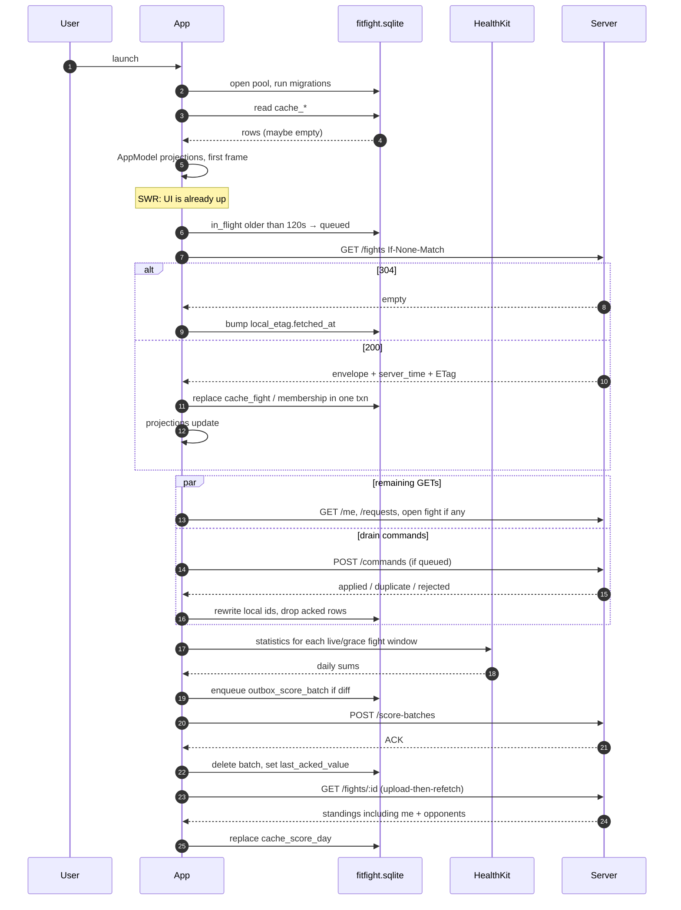
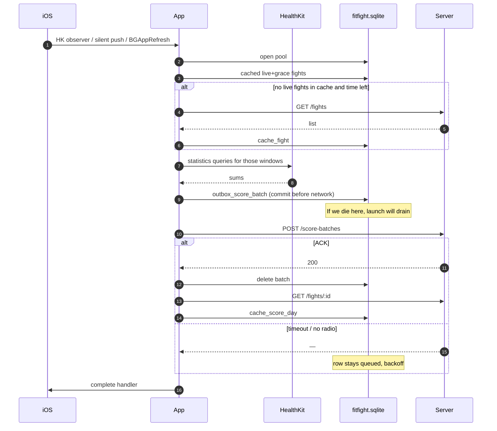

# Sync — cache, refresh, outbox

This is law for fights, scores, and HealthKit. Not a suggestion.

Today the app is one in-memory `AppModel` of fixtures. `voted` and `joined` die when the
process does. That cannot survive a killed app, a late Apple Watch, or a month-long fight.

The rest of this file is what we build instead — before “real fights”, not after.

## Law

1. **The server owns fights, members, invites, pots, votes, and settlement.** The phone
   displays a replica. It does not decide a winner.
2. **HealthKit owns the body.** Raw samples never enter our sqlite, our API logs, iCloud,
   or a push payload. The phone compiles daily totals and uploads those.
3. **One write path.** Views call `AppModel.submit(_: UserIntent)`. Only `SyncEngine`
   talks to the network. Only `CacheWriter` writes `cache_*` tables. Only
   `ScoreCompiler` imports HealthKit.
4. **GRDB.** Not SwiftData, not CloudKit, not JSON files, not `UserDefaults` for fights.
5. **Stale-while-revalidate.** Paint cache immediately. Revalidate in the background.
   Pull-to-refresh is the same fetch with a spinner, not a different data path.
6. **Outbox for anything the user meant.** Kill the app mid-request and the intent is
   still on disk. Retry with the same idempotency key.
7. **Upload-then-refetch.** After a score batch ACKs, GET that fight. Do not locally
   invent the opponent’s row or the pot.
8. **The sqlite file is excluded from iCloud backup.** After a device restore: sign in,
   refetch, recompile HealthKit. Reconstructable. No PHI in iCloud.
9. **Small data.** Dozens of fights, tens of score days, not millions. Design for
   correctness and agent-proofing, not sharding.
10. **Fixtures go through the same writer**, or they stay in `AppModel.preview()`. There
    is no third path that views can “just assign”.

Privacy, SIWA, and “what may leave the phone” live in [`security.md`](security.md)
when that file is on the branch. This file owns cache, refresh, and the outbox.
If the two disagree on a health row, **minimization wins**: daily total, this
fight, this window, nothing else.

## Pick: GRDB

| | JSON snapshots | SwiftData | GRDB (pick) |
| --- | --- | --- | --- |
| Transactions (optimistic row + outbox row) | Hope | Opaque | `db.write` |
| Background HK wake (30s, not MainActor) | File races | Context rules fight you | One `DatabasePool`, WAL |
| CloudKit / iCloud footgun | Low | **One `@Model` + a checkbox and scores are in iCloud** | No CloudKit |
| Migrations agents can append | Ad hoc files | Cryptic | `0003_….swift`, never edit 0001 |
| Query one fight’s days | Decode the world | `@Query` in the view (bypasses Sync) | `FightID` index |
| CI on Linux | grep | cannot compile | grep + SQL in docs |

JSON snapshots are fine for a weekend prototype. They become a fourth JSON file the
first time someone adds an outbox, then a fifth for ETags, then two writers and a
corrupt merge. Do not start there “until the backend exists”.

SwiftData is the wrong default for a 6–9 month agent-built app: views will `@Query`,
someone will enable CloudKit to “sync between devices”, and we will have stored step
totals in iCloud. Even without CloudKit, the only legal writer (SyncEngine) is
unenforceable.

**GRDB:** typed `FetchableRecord` structs, numbered migrations, WAL, one writer queue,
outbox and cache in the same transaction, no iCloud, testable with an in-memory
`DatabaseQueue`. SPM package `GRDB`. Database file:

```
Application Support/FitFight/fitfight.sqlite
NSURLIsExcludedFromBackupKey = true
```

Keychain (not sqlite) for tokens: `kSecAttrAccessibleAfterFirstUnlockThisDeviceOnly`,
`kSecAttrSynchronizable = false`. Background wakes happen before the next unlock;
tokens must be readable. They must not roam to another device via iCloud Keychain.

`UserDefaults` stays for Look / Design (`ff.design`). Never a fight id.

---

## Layers

```
HealthKit store          ← samples live only here
        │ compile (sums)
        ▼
sqlite  fitfight.sqlite  ← cache_* (server replica)
                         ← outbox_* (unacked intents + score batches)
                         ← local_* (etags, compile watermarks — not samples)
        │ ValueObservation
        ▼
memory  AppModel         ← what SwiftUI watches ([Fight], etc.)
        ▲
        │ submit(UserIntent) / refresh(SyncTrigger)
        ▼
network APIClient        ← REST + If-None-Match; no websockets
```

### Memory (`AppModel`)

What the eleven Fights designs already read. Keep `ObservableObject`. Do not churn
them onto `@Query`.

- Hydrated from sqlite on launch (milliseconds at our size).
- `@Published` projections: `fights`, `requests`, `you`, `history`, plus
  `syncBanner: SyncBanner?` (`updated 2h ago` / `sending…` / `couldn’t reach server`).
- **Read-only except** `submit` and `refresh`. No `fights.append` from a view.
- Preview / `FF_SHOOT=1`: `AppModel.preview()` still in-memory fixtures, **no database**.
  Screenshot CI must not depend on GRDB. Production never uses `preview()`.

### sqlite (source of truth on device)

Replica + outbox. See [tables](#sqlite-tables).

### Network (source of truth in the world)

REST JSON, ETags, command batch, score batch. See [HTTP](#http). No GraphQL, no
Firebase, no websocket. Silent push is an **invalidation**, not a score payload.

### HealthKit (not a cache layer)

`HKStatisticsQuery` / `HKStatisticsCollectionQuery` for the fight window. Never
enumerate samples into our types. We persist the **sum for a civil day**, then delete
the outbox row when the server ACKs.

---

## Types (Swift)

IDs are typed. `String` fight ids in views are how the fixture bug of joining `"sweat"`
against a typo happens.

```swift
struct UserID: Hashable, Codable, RawRepresentable { var rawValue: String }
struct FightID: Hashable, Codable, RawRepresentable { var rawValue: String }
struct RequestID: Hashable, Codable, RawRepresentable { var rawValue: String }
struct CommandID: Hashable, Codable, RawRepresentable { var rawValue: String } // UUID

/// Civil date in the *fight's* IANA timezone, `yyyy-MM-dd`.
struct FightDay: Hashable, Codable, RawRepresentable { var rawValue: String }

enum UserIntent: Equatable {
    case createFight(CreateFightDraft)
    case acceptInvite(FightID)
    case declineInvite(FightID)
    case vote(RequestID)
    case unvote(RequestID)
}

enum SyncTrigger: Equatable {
    case appLaunch
    case foreground
    case pullToRefresh
    case silentPush(SyncScope)
    case outboxAck(SyncScope)
    case hkObserver
    case bgAppRefresh
}

enum SyncScope: Equatable {
    case all
    case me
    case fights
    case fight(FightID)
    case requests
}
```

`CreateFightDraft` is the New tab form (metric, invitee ids, length, stake, settlement,
daily goal). It is not a `Fight`. A `Fight` exists after the server applies the command.

Existing UI types (`Fight`, `Standing`, `Person`, `RequestItem`) stay as **projections**.
They are not GRDB records. Records live in `Persistence/Records/`. `FightProjection`
builds a `Fight` from `cache_fight` + `cache_membership` + `cache_score_day` + optional
`cache_settlement`. Rank, `projectedNet`, pace, SAFE/AT RISK, kicker copy are computed
here (and/or copied from the server `display` block on last fetch). **They are not
columns.** If an agent adds `cache_fight.rank`, that is a bug.

`FightStatus` grows one value the fixtures do not have:

```swift
enum FightStatus: String {
    case invited, live, grace, finished, cancelled
}
```

`grace` = window ended, settlement not frozen yet (late HealthKit still accepted).
The server owns the transition. The phone does not local-timer into `finished`.

---

## sqlite tables

Prefix is the access rule:

| Prefix | Who writes | Meaning |
| --- | --- | --- |
| `cache_` | `CacheWriter` only, from HTTP / fixture bootstrap | Server replica |
| `outbox_` | `Outbox` enqueue; `OutboxDrainer` updates state; delete on ACK | Unacked work |
| `local_` | `SyncEngine` / `ScoreCompiler` | Device bookkeeping |
| `meta_` | migrations / engine | kv |

No JSON columns except `outbox_command.body` and `cache_settlement.payload`.
Everything else is real columns so a fight’s days are queryable.

### `meta_kv`

| column | type | |
| --- | --- | --- |
| `key` | TEXT PK | `schema_user`, `clock_offset_ms`, `last_auth_user` |
| `value` | TEXT | |

### `cache_user`

Exactly one row when signed in: `id`, `handle`, `name`, `initials`, `created_at`.

### `cache_person`

People we have seen (you + opponents + invitees): `id`, `name`, `handle`, `initials`,
`avatar_url` (remote; photos are not HealthKit).

### `cache_fight`

| column | type | |
| --- | --- | --- |
| `id` | TEXT PK | server id, or `local:{uuid}` until ACK |
| `code` | TEXT | `FIGHT-742` |
| `name` | TEXT | |
| `metric` | TEXT | `steps` / `activeMinutes` / `workouts` |
| `iana_tz` | TEXT | frozen at create (creator’s). Shared Day 1 columns need one tz per fight, not one per joiner |
| `start_day` | TEXT | civil `yyyy-MM-dd` in `iana_tz` |
| `length_days` | INT | |
| `window_start` | DATETIME | instant |
| `window_end` | DATETIME | instant |
| `grace_until` | DATETIME | nullable until live |
| `status` | TEXT | `FightStatus` |
| `settlement_kind` | TEXT | |
| `buy_in` | INT | |
| `pot` | INT | server-computed |
| `daily_goal` | REAL | nullable |
| `created_by` | TEXT | `UserID` |
| `etag` | TEXT | strong, from `GET /v1/fights/:id` |
| `updated_at` | DATETIME | server |
| `pending_command_id` | TEXT | nullable; set while optimistic create/accept |

`days_left`, `rank`, `kicker*`, `listSubtitle` are **not stored**.

### `cache_membership`

PK `(fight_id, user_id)`. `status` = `invited | joined | declined`. `buy_in`, `joined_at`.

### `cache_score_day`

PK `(fight_id, user_id, day)`. `value REAL`, `updated_at`.

These are **server projections of already-accepted totals**, including opponents.
They are not HealthKit samples. Still: this file is not backed up to iCloud.

A day is a civil date in **that fight’s `iana_tz`**. Two overlapping step fights with
different timezones are two rows, compiled twice. At our size that is the point —
do not build a global hourly warehouse in v1.

Do not compile “8,240 steps today” for the You tab into sqlite or the server
unless that person is in a live/grace steps fight. The profile tile can read
HealthKit on the fly while the app is open.

### `cache_settlement`

PK `fight_id`. `version INT`, `payload TEXT` (JSON: per-user `net`, `rank`, `safe`),
`computed_at`. Written once when the server freezes. Immutable from the phone’s
point of view.

### `cache_request` / `cache_vote`

Requests tab. `cache_vote` is `(request_id)` for **your** vote only; count lives on
`cache_request.votes` as last-server-value, optimistic ±1 in memory until refetch.

### `local_etag`

PK `resource` (`me` / `fights` / `fight:{id}` / `requests`).
`etag`, `fetched_at`, `stale_after`.

### `local_hk_cursor`

PK `(fight_id, day)`. `last_value`, `last_compiled_at`, `last_acked_value`.
**Watermarks.** If you are about to store a sample UUID or a heart-rate point, stop.

### `outbox_command`

| column | type | |
| --- | --- | --- |
| `id` | TEXT PK | `CommandID` (UUID), also the idempotency key |
| `type` | TEXT | `create_fight` `accept_invite` `decline_invite` `vote` `unvote` |
| `body` | TEXT | JSON |
| `state` | TEXT | `queued` `in_flight` `failed_terminal` |
| `tries` | INT | |
| `next_attempt_at` | DATETIME | |
| `last_error` | TEXT | |
| `created_at` | DATETIME | |
| `acked_at` | DATETIME | nullable |

### `outbox_score_batch`

| column | type | |
| --- | --- | --- |
| `id` | TEXT PK | UUID |
| `idempotency_key` | TEXT UNIQUE | see below |
| `fight_id` | TEXT | |
| `from_day` | TEXT | |
| `to_day` | TEXT | |
| `payload` | TEXT | JSON array of `{day, value}` |
| `compiled_at` | DATETIME | |
| `state` | TEXT | same as commands |
| `tries` | INT | |
| `next_attempt_at` | DATETIME | |

On ACK: delete the row (do not keep day totals around “for debug” — that is how PHI
lingers). Keep `local_hk_cursor.last_acked_value` only.

Commands and score batches are **separate tables and separate HTTP**. Do not multiplex.

---

## Local schema vs Postgres

**Do not clone Postgres onto the phone.**

Server (sketch, names may differ, mapping lives only in `APICodec`):

- `users`
- `fights` (window, tz, metric, settlement_kind, status, etag generation)
- `fight_members`
- `score_days` `(fight_id, user_id, day, value, source_revision, compiled_at)`
- `commands` `(id PK, user_id, type, body, applied_at)` — unique `id` = client UUID
- `settlements` `(fight_id PK, version, payload, computed_at)`
- `push_tokens`

Phone `cache_*` is a **read model for the four tabs**, not 3NF. Skip columns the UI
does not show. When a field is needed: API envelope → `APICodec` → column →
projection. Never “I saw it on the server ERD so I added the table”.

Server `score_days` are **per fight**. The compiler uploads per fight. A user in two
live step fights sends two batches. Duplicate work, zero timezone-join bugs.

Derived money (projected net, SAFE) may be in the GET `display` block so copy matches
what Marc saw in the mock. The phone may recompute for a snappy optimistic accept;
the next GET overwrites it. Settlement `payload` is the only frozen money.

---

## HTTP

Base `/v1`. Bearer access token. Every **GET** body includes `"server_time": iso8601`
so the phone can store `clock_offset_ms`.

| method | path | etag | |
| --- | --- | --- | --- |
| GET | `/me` | `me` | |
| GET | `/fights` | `fights` (weak) | summaries: id, status, updated_at, list fields |
| GET | `/fights/:id` | `fight:{id}` (strong) | members, score days, display, settlement if any |
| GET | `/requests` | `requests` | |
| POST | `/commands` | — | array of commands, each with `id` |
| POST | `/score-batches` | — | one fight per call |
| POST | `/push-token` | — | APNs token |
| POST | `/auth/refresh` | — | |

`GET` sends `If-None-Match: <etag>`. `304` = bump `fetched_at` / `stale_after`, keep
rows. `200` = replace that resource **in one transaction**.

Do not send scores in APNs. Push payload is a scope:

```json
{ "scope": "fight", "id": "…" }
{ "scope": "fights" }
{ "scope": "requests" }
```

Visible notifications (invite, “open so we can sync”, settled) are copy only. No
step counts, no money amounts on the lock screen (Apple + backlog).

### Stale ages

| resource | `stale_after − fetched_at` |
| --- | --- |
| live / grace fight | 30s |
| fight list | 30s |
| finished fight | 1h |
| requests | 5min |
| me | 15min |

Pull-to-refresh and silent-push ignore `stale_after` and revalidate anyway.
Foreground: if `now > stale_after` on `fights`, refresh. Coalesce in-flight GETs
per scope so launch + foreground + push do not triple-fetch.

`SyncEngine.refresh` is the only entry. Triggers (`pullToRefresh`, `silentPush`, …)
are arguments, not parallel implementations.

---

## Invalidation

Everything funnels to `SyncEngine.invalidate(_ scope, trigger:)`.

| Trigger | Scope | UI |
| --- | --- | --- |
| App launch | `all` | SWR: paint cache, then fetch |
| `scenePhase == .active` | `fights` if stale | silent |
| Pull-to-refresh | current screen’s scope | spinner |
| Silent push | payload scope | silent; 30s budget |
| Score or command ACK | that `fight` / `requests` | upload-then-refetch |
| HK observer / BGAppRefresh | compile + drain + refetch dirty fights | none (maybe killed) |

**Tick order** (same function every time, skip steps that do not apply):

1. Recover `in_flight` outbox rows older than 120s → `queued` (crash / kill).
2. Drain `outbox_command` (auth errors abort the tick).
3. GET stale / requested resources.
4. Compile HealthKit for `live` + `grace` fights in cache.
5. Drain `outbox_score_batch`.
6. GET fights whose batches just ACKed.

Never compile before we know which fights exist, except on a tight HK wake where
the GET would blow the budget: then compile from **cached** live/grace rows, upload,
and skip the extra GET if time is gone. Next launch catches up.

---

## Outbox

### Commands (social)

```json
POST /v1/commands
{
  "commands": [
    { "id": "3fa8…", "type": "accept_invite", "body": { "fight_id": "…" } }
  ]
}
```

`id` is the client UUID and the idempotency key. Server: unique index on
`commands.id`. Replay returns `duplicate` with the same `resource_id`.

Response per command: `{ id, status: applied | duplicate | rejected, resource_id, error }`.

Optimistic:

- **create_fight** — insert `cache_fight` with `id = local:{uuid}`, `status = live`
  (or `invited` for others — they do not see it until the server applies). Rewrite
  id to server id on ACK inside one transaction (memberships, score days, pending
  outbox fight_id).
- **accept_invite** — membership → `joined`, fight moves live with zeros until scores
  land.
- **vote** — `cache_vote` insert, `votes + 1`. Unvote inverse.

`rejected` (expired invite, fight cancelled): delete optimistic rows, set
`failed_terminal`, toast. Do not retry.

Backoff: `min(900, 2^tries) + jitter(0…2s)` seconds. 429 uses `Retry-After`. Forever
until ACK except `failed_terminal` and paused-for-auth.

### Score batches (body)

Compile with statistics queries, fight tz, each civil day in `[start_day, min(today, last_window_day)]`.
Re-query the whole window every time (≤ ~31 days). Diff against
`local_hk_cursor.last_acked_value`. Enqueue changed days.

One HTTP per fight, dirty days grouped:

```http
POST /v1/score-batches
Idempotency-Key: scores:{user}:{fight_id}:{from}:{to}:{sha256(payload)}
```

```json
{
  "fight_id": "…",
  "compiled_at": "2026-08-23T23:10:00Z",
  "source_revision": "{hash of payload + compiled_at}",
  "days": [{ "day": "2026-08-22", "value": 11002 }]
}
```

If HealthKit revises a day, the payload hash changes → new key → server **overwrites**
that `(fight_id, user_id, day)` if `compiled_at` is newer **and** `now < grace_until`.
After freeze: `409 window_frozen`. Keep the batch `failed_terminal`, do not loop.
The numbers were late; they do not count. UI: already-finished fight, no banner of
the raw value.

Partial upload: the **HTTP request** is the atomic unit. Timeout before response →
retry **same** key; server no-ops if it already applied. Never “upload day 1–3,
fail day 4, keep 1–3 in a half-written local state”. Either the batch is in_flight /
acked / queued as a whole.

Do not PUT a running total for the whole fight. Days get revised; totals must be
re-summable on the server.

---

## Conflict rules

| Data | Winner | Rule |
| --- | --- | --- |
| Fight name, window, members, invites, pot, votes, status, settlement | **Server** | Social. Two phones will race. Last applied command on the server wins; the replica is replaced on GET. |
| **My** daily value inside a fight | **This device’s HealthKit compile**, then server stores last accepted batch | The server does not invent steps. A second device of mine is **view-only** in v1 (no compile). Document that; do not silently max() two phones. |
| Opponent scores | **Server** | We never read their HealthKit. |
| Rank, projected net, pace, SAFE, kickers, `daysLeft` | **Recompute** from replica + `server_time` | Do not persist. `daysLeft` uses `clock_offset_ms`, not device clocks as truth. |
| Settlement | **Server, once, immutable** | Phone cannot settle while killed. No local “it hit midnight so pay out”. **No successful score upload in the window → unscored, buy-in refunded** (server rule; the phone just displays `cache_settlement`). |
| Clock | **Server `server_time`** | See [clock skew](#clock-skew). |
| Same day, late Watch data | Newer `compiled_at` overwrites until `grace_until` | After freeze, reject. |

Grace: **6 hours** after `window_end` (server constant). Visible push at `window_end`:
“open so we can sync” — already on the backlog. Then freeze, compute settlement
idempotently, push `fight` scope.

---

## What “offline” actually means

Offline = no successful HTTP, or auth paused. sqlite still works. HealthKit still
compiles.

| Action | Offline |
| --- | --- |
| Browse list / detail already fetched | Yes. Banner if `fetched_at` is old. |
| Open a fight never fetched | Empty / couldn’t load. No fixture filler in production. |
| **Create fight** | Yes, into outbox. Optimistic card “Saved on this phone. Friends are invited when you’re back online.” The clock does **not** start until the server applies. Body: `proposed_start` (usually now). Server sets `window_start = max(proposed_start, applied_at)`. A phone in airplane mode for three days does not get a backdated 7-day fight. |
| **Accept / decline invite** | Yes, outbox + optimistic move to live. Server may `rejected` (full, expired, cancelled) → revert. |
| **Vote / unvote** | Yes, optimistic. Server last write; duplicate is `duplicate`. |
| New request compose | Same as create (when that screen exists). |
| Settle / pay | **No.** Disabled until `cache_settlement` exists. |
| Compile HK | Always. Network not required. |
| Upload HK / commands | Needs network. Rows wait. |

Creating a fight is not “a local fight that will sync”. It is a **command**. Other
people do not see it, the code `FIGHT-xxx` does not exist, and settlement cannot
run, until apply. If the user force-quits, the command is still in `outbox_command`.

---

## Sequence: app open



Cold start, empty cache, signed in: first frame is the real empty state (or a
skeleton), **not** Leo/Sam fixtures. Then GET fills it.

Cold start, signed out: auth UI. Outbox of a previous user must already have been
wiped on logout (delete sqlite file, keep Keychain empty).

---

## Sequence: HealthKit background wake

iOS may give ~30 seconds, or nothing. Treat the outbox as the real persistence.



Silent push for “Leo logged steps” does **not** include Leo’s number. It is
`{scope: fight, id}`. If we have no pending outbox, skip compile and just GET.
If we also have dirty days, drain first, then GET (upload-then-refetch).

Do not schedule local notifications with scores. Do not start a long `BGProcessing`
task that assumes it will finish a month.

---

## Sequence: fight ends

```mermaid
sequenceDiagram
    autonumber
    participant Clock as Server clock
    participant Job as Settle job
    participant API as Server
    participant APNs
    participant App
    participant HK as HealthKit
    participant DB as fitfight.sqlite

    Clock->>Job: now >= window_end
    Job->>API: status = grace, grace_until = now+6h
    Job->>APNs: visible "open so we can sync" + silent {scope:fight}
    APNs->>App: maybe (killed / denied / flaky)
    opt app woken or later opened
        App->>HK: compile remaining days
        App->>API: POST /score-batches
        API-->>App: 200 or 409 window_frozen
        App->>API: GET /fights/:id
    end

    Clock->>Job: now >= grace_until
    Job->>API: freeze window, INSERT settlements (idempotent), status = finished
    Job->>APNs: silent {scope:fight} + optional visible "fight settled"
    APNs->>App: maybe
    App->>API: GET /fights/:id
    API-->>App: settlement payload
    App->>DB: cache_settlement, status finished
    Note over App: payout UI from payload; Pay is still a later product
```

If the phone never woke in grace: settlement runs on whatever `score_days` the
server already had (often yesterday’s upload). That is the product, not a bug.
The visible nudge exists because background delivery is flaky.

The phone **never** flips `live → finished` because `Date() > window_end`.

---

## Failure modes

### Partial upload

Batch is atomic. HTTP timeout: same `Idempotency-Key`. Server unique on that key.
Do not split a batch on retry. Do not mark days acked locally without HTTP 200.

### Clock skew

Every GET carries `server_time`. Store
`clock_offset_ms = server_time − Date()`. Fight boundaries, `daysLeft`, grace,
and “today” in a fight tz use `Date() + offset`. If `|offset| > 5 minutes`, still
follow the server; a debug log is enough. Do not pop an alert. Do not trust the
device to end a month.

NTP-sane iPhones are usually fine; the failure is “user set 2019” or a simulator.

### Token expiry

`401` on any call → `POST /auth/refresh` (refresh token in Keychain). Success:
retry the original call once. Failure: **pause** outbox (`state` stays `queued`,
do not increment `tries` into the stratosphere), wipe access token, show sign-in.
Do not delete score batches. After re-auth, drain.

Logout: delete `fitfight.sqlite`, delete tokens. Next user on the same phone must
not see Maya’s replica.

### App killed mid-flight

`in_flight` + `updated_at` older than 120s at next open → `queued`. The server
idempotency key makes a double POST safe.

### Push never arrives

Covered by launch SWR, foreground, PTR, daily compile on open, and the visible
end-of-window nudge. There is no correct “local notification 30 days out” while
killed that we can trust.

### HK auth revoked / Watch unpaired

Apple does not tell us “denied” vs “rest day”: a query comes back empty. That
must not become a column of uploaded zeros (it would look like they walked
none, and it would overwrite a good earlier day). Skip the day; send **no**
batch. Server settlement: no successful upload in the window → unscored, stake
returned — not “last place with 0”. You → Data sources can still say
disconnected when the entitlement is off; we still do not invent scores.

Genuine 0 steps for an authorized query is uploadable. Query **failure** is not.

### Two devices, one user

v1: **one compiling device** — the iPhone that granted HealthKit. iPad / second
phone: replica only. If we ever compile on two devices, last `compiled_at` would
fight Watch-vs-iPad completeness. Do not paper over that with `max(steps)`.

### ETag / 412 / lost cache

Full GET that resource, replace rows. Do not merge field-by-field (agents will
get it wrong). Whole document replace per fight id.

### Disk full

Writes throw; keep last memory snapshot; banner. Rare at our size.

### Fixture leak

`AppModel.preview()` used in `FitFightApp` production init is a bug. CI grep:
`@main` file must not call `preview()`.

---

## Agent-proofing

The next nine months will add screens. The architecture fails if a screen can
talk to URLSession “just this once”.

### Folders (when this leaves paper)

```
FitFight/
  App/                 ContentView, tabs, AppModel façade
  DesignSystem/        tokens, components
  Designs/             the eleven directions — read AppModel only
  Domain/              FightID, UserIntent, projections — no GRDB, no HK, no URLSession
  Persistence/         AppDatabase, Migrations/0001_init.swift, Records/
  Sync/                SyncEngine, APIClient, OutboxDrainer, ScoreCompiler, CacheWriter
```

New `.swift` files still go in `project.pbxproj` (explicit list).

### Allowed imports

| Import | Allowed in |
| --- | --- |
| `HealthKit` | `FitFight/Sync/ScoreCompiler.swift` only |
| `GRDB` | `Persistence/`, `Sync/` |
| `URLSession` / `APIClient` | `FitFight/Sync/APIClient.swift` only |
| SwiftUI | App, DesignSystem, Designs, not `APIClient` |

CI: `scripts/check-sync-boundaries.py` (Linux, every PR). Forbidden today even
before the folders exist: SwiftData, CloudKit, `NSUbiquitousKeyValueStore`,
`CKRecord`.

### AppModel is the façade

Designs and tabs keep compiling against `model.live`, `model.submit(.acceptInvite(id))`.
They do not import GRDB. They do not hold a `DatabaseQueue`.

### Migrations are append-only

`Persistence/Migrations/0001_init.swift` is never edited. Need a column? `0002_…`.

### Tests worth writing when code exists

- Outbox drain with a fake `APIClient`: timeout then 200 duplicate → one server apply.
- Crash recovery: `in_flight` → `queued`.
- Compiler: HK fake returns a revised day → new idempotency key.
- Projection: settlement payload beats local rank maths.
- `FF_SHOOT=1` still does not open sqlite.

### Explicit non-goals (say no)

- CloudKit / iCloud KV / SwiftData
- Storing HK samples, heart rate, location, workout routes
- Websocket live leaderboards
- Merging two compiling devices with `max()`
- Local timers that settle a fight
- Push bodies that contain scores or dollar amounts

---

## Build order (do not skip)

The fixtures stay until this stack exists. Do not “just URLSession in FightsListView”.

0. **This doc + CI grep** (this PR).
1. **GRDB shell** + `CacheWriter` + `AppModel` reading sqlite. Bootstrap fixtures
   through `CacheWriter` in DEBUG if you must, still no network.
2. **`APIClient` + ETags + SWR + PTR + foreground** against a real or stub HTTP.
   Empty production cache, no Leo.
3. **`UserIntent` + `outbox_command`** for accept / vote / create. Optimistic + ACK.
4. **`ScoreCompiler` + `outbox_score_batch`**, upload-then-refetch. Entitlements.
5. **Silent push** + grace/settle job on the server. Visible end-of-window nudge.

Step 4 without step 3 still loses accepts when killed. Step 5 without 4 cannot
settle honest numbers. Step 2 without 1 puts network on the view again.

Marc: Apple HealthKit + Push + Background Modes capabilities are **his** (Account
Holder). Agents cannot click those. APNs key is a GitHub secret, never the repo.
Tell him when a build needs a new capability; do not send him into docs.

---

## Current code map (so the first PR knows what to break)

| Today | Tomorrow |
| --- | --- |
| `AppModel` owns `[Fight]` literals | `AppModel` projects from `cache_*`; `preview()` keeps the literals |
| `joined: Set<String>` | `submit(.acceptInvite)` → outbox + membership row |
| `voted: Set<String>` | `submit(.vote)` → `outbox_command` + `cache_vote` |
| New fight `Start` → `tab = .fights` | `submit(.createFight(draft))` |
| `FightStatus` live/invited/finished | plus `grace`, `cancelled` |
| No file on disk | `fitfight.sqlite`, excluded from backup |
