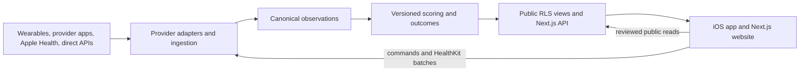
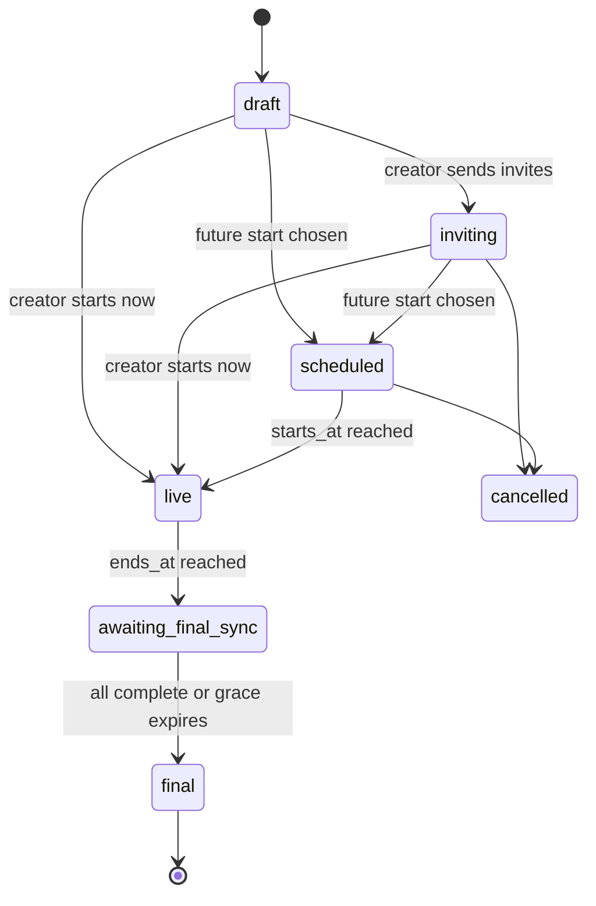
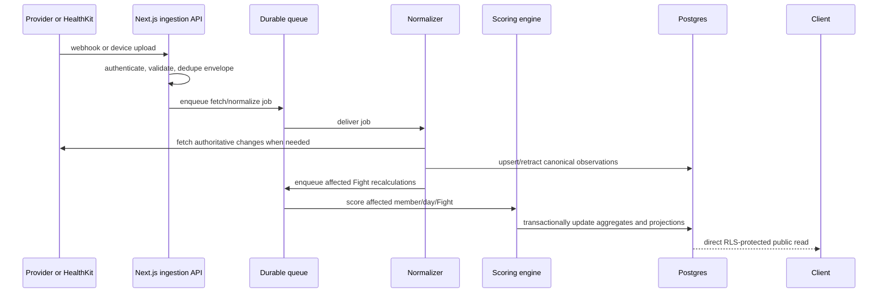

# FitFight system design

Status: **approved architecture; detailed Metric and payment specifications remain future work**

Last reviewed: **2026-08-24**
Decision horizon: **the next 6–12 months**

This is the source of truth for how the real FitFight product should be built. It covers the iOS app, website, backend, authentication, access, fitness providers, synchronization, scoring, notifications, links, privacy, operations, and repository layout.

**How to use this document:** it is a golden guide, not a build checklist. Follow it so new work fits the same model. Do not implement the whole thing. Current work is the empty platform (`supabase/`) and then the minimum Apple Health **Steps** Fight. Do not build Active Minutes, Workout Count, direct WHOOP/Strava, payments, notifications, social, or the website until [`backlog.md`](backlog.md) says so. The mock New screen may still show three metrics because that is the approved design kit; production scoring is Steps only.

This is a reference, not a requirement to build everything at once. Sections 1–9 contain the product and architecture decisions; the later sections explain how those decisions can be implemented safely when their phase arrives.

The product language is fixed in [`CONTEXT.md`](../CONTEXT.md). The current SwiftUI app is a design-accurate mock with fixtures; this document describes the production system that replaces those fixtures.

## 1. Architecture decisions

These are the recommended calls that will still look sensible in a year:

1. **Use one modular monorepo.** Keep the existing iOS project where it is for now; add `web/`, `supabase/`, and `contracts/` without a disruptive move.
2. **Use Supabase in US East for data infrastructure.** Use Postgres, Auth, Queues, Cron, and Storage. Production is the main hosted project; staging is a persistent Supabase branch; local development uses the CLI stack. Do not use Supabase Edge Functions.
3. **Use one Next.js Node.js project for the website and backend.** The visible website is marketing, legal, authentication, invitation fallback, and download pages. Route Handlers provide the iOS API, provider webhooks, and queue workers; there is no web version of the native product.
4. **Use direct Supabase access without surrendering server authority.** Swift authenticates, reads reviewed `public` tables/views, and performs only explicitly whitelisted self-only profile/preference writes through the Supabase SDK and RLS. It sends sensitive data and domain commands to Next.js; clients never decide scores, ranks, state transitions, or final results.
5. **Start with Apple Health as the iOS data gateway.** It already aggregates Apple Watch, iPhone, WHOOP, Garmin, Strava, and many other apps when users enable those connections.
6. **Put provider behavior behind adapters while keeping provenance visible.** Provider-specific APIs do not enter scoring logic, but every score and shared activity retains and displays its provider, originating app/device, and verification state.
7. **Synchronize continuously after one clear Collection consent.** Import the maximum supported and contractually permitted history, continue collecting even when no Fight is live, and reuse that data for personal history, recommendations, feeds, and future Fights.
8. **Make data sharing part of Fight acceptance.** Accepting a Fight authorizes its relevant stored Metric and selected Data source to produce a derived score visible to the other members; it does not require a second granular health-permission flow.
9. **Use one scoring Data source per member, per Metric, per Fight.** Do not add Apple Health steps to Garmin steps or a WHOOP workout to its Strava copy. Show the chosen source so everyone understands the comparison.
10. **For each approved Metric, preserve every accessible representation.** For Steps, retain raw HealthKit samples and deletion tombstones, Apple's merged daily total, per-source daily statistics, and full available provenance. Do not collect unrelated HealthKit types, provider payloads, routes, heart rate, or sleep until a feature needs them and terms permit them.
11. **Use durable jobs and idempotent processing.** Webhooks are hints, delivery can repeat or arrive out of order, and provider data can be edited or deleted.
12. **Use a generic Metric model while shipping Steps first.** Numeric Metrics share canonical Observation storage; activities later share a separate generic activity model. Active Minutes and Workout Count stay out of production until their definitions receive a separate product-design pass.
13. **Keep stakes informational in v1.** FitFight records the agreed outcome but does not hold funds, operate a wallet, or automatically pay winners until legal, payments, and App Store review are complete.
14. **Use Universal Links as the one link system.** The same HTTPS URL opens the exact native screen when installed and a useful Next.js page when it is not.
15. **Treat data freshness as product data.** Every score carries its source, last successful sync, completeness state, and revision.
16. **Open-source the monorepo under Apache-2.0.** Keep the FitFight name, logo, App Store identity, infrastructure, secrets, and User data outside that license or protected separately.
17. **Do not start with microservices, Kafka, GraphQL, or a separate data warehouse.** A modular Next.js/Postgres system with a durable queue is enough for the next 6–12 months and leaves clean extraction seams.

## 2. Product and system boundaries

FitFight needs to answer two questions reliably:

> For each accepted member of this Fight, what qualifying activity occurred inside the agreed Fight window, and what result follows from the agreed rules?

> Outside a Fight, what activity history is useful to the User for progress, a future feed, and fair Goal recommendations?

FitFight still does **not** need to become a general health warehouse. It preserves full fidelity for explicitly supported product Metrics—Steps first—while avoiding unrelated biometrics and provider payloads that no FitFight feature uses.

The system has six logical areas:



### Sources of truth

| Concern | Authority |
| --- | --- |
| User identity and sessions | Supabase Auth |
| Profiles, friendships, Fights, membership, rules | Postgres |
| Provider authorization | The provider plus FitFight's encrypted connection record |
| Raw activity | The originating provider or device store |
| Canonical observations | Postgres after adapter validation |
| Live scores and ranks | Server scoring engine |
| Final result | Versioned server outcome transaction |
| UI state | Server read model; local state is only a cache or draft |
| Notification delivery | Server outbox plus APNs delivery state |

## 3. Deployment and repository shape

### Keep one repository

Use the existing public repository as a modular monorepo:

```text
FitFight/                       existing native SwiftUI app
FitFight.xcodeproj/             existing Xcode project
web/                            Next.js App Router website
  app/api/                      iOS API, callbacks, webhooks, workers
  src/server/                   domain, adapter, normalizer, scoring modules
supabase/
  migrations/                   reviewed schema and RLS migrations
  tests/                        pgTAP RLS and database tests
contracts/
  openapi.yaml                  versioned client/server contract
  schemas/                      shared JSON schemas and event envelopes
docs/
  system-design.md              this document
```

Do not move the iOS files merely to create an aesthetically perfect `apps/ios` folder; that would create Xcode and CI churn without product value. A later move is harmless once the backend and web layouts have stabilized.

One repository is the right call because a Fight schema, invitation route, scoring rule, privacy copy, and iOS/web presentation often change together. Pull requests can validate the whole contract atomically. Split repositories only when separate teams require independent permissions or release ownership—not because there are multiple deployables.

### Deployables

| Deployable | Platform | Trigger |
| --- | --- | --- |
| iOS app | GitHub Actions `macos-26` → TestFlight | Existing app push flow |
| Next.js website and backend | Vercel, Node.js runtime | Changes under `web/` |
| Database | Supabase migrations | Explicit CI deployment by environment |
| Scheduled jobs | Supabase Cron | Migration-managed schedules |

The repo remains public. Publishable Supabase keys and project URLs may be client configuration, but provider secrets, the Supabase secret/service key, APNs `.p8`, OAuth client secrets, database credentials, and encryption keys must stay in GitHub/Vercel/Supabase secret stores.

### Open-source posture

Keep the iOS, web, backend Route Handlers/modules, migrations, contracts, and documentation public. Database rows, production logs, secrets, provider credentials, and user media are infrastructure/data and are never committed.

A public GitHub repository is not legally open source until it has a license. The approved setup is:

- Apache-2.0 for code
- `CONTRIBUTING.md` with the local test and pull-request flow
- `SECURITY.md` with private vulnerability reporting
- A Code of Conduct and lightweight contributor sign-off/DCO
- A trademark notice reserving the FitFight name, logo, and App Store identity

Publishing the schema and RLS policies is acceptable: security must come from authentication, grants, RLS, encryption, and secret management—not from hiding the source. Apache-2.0 permits use, modification, redistribution, and commercial forks while preserving notices and providing an explicit patent grant. A separate trademark notice reserves the FitFight name, logo, App Store listing, and hosted service identity.

### Environments

Use one local stack, one persistent staging branch, and one production project:

- **Local**: `supabase start` runs Postgres, Auth, and Storage locally. It is not a hosted Supabase environment and costs nothing.
- **Staging**: GitHub branch `develop`. A long-lived persistent branch of the production Supabase project, also named `develop`, with fake/test Users, stable branch credentials, staging OAuth callbacks, and staging secrets.
- **Production**: GitHub branch `main`. The main Supabase project in **US East (North Virginia)** with real Users, production OAuth callbacks, and production secrets.

The persistent branch is still a fully isolated Supabase instance: it has its own project URL, publishable key, secret key, database, Auth users, Storage, secrets, and provider callback URLs. Production data is never copied into it. The branch remains attached to the production project for management, GitHub integration, and schema promotion.

Connect Supabase Branching to GitHub. Migrations, seed data, and non-secret Auth/API settings live in `supabase/` and `config.toml`; branch-specific secrets are injected separately and never copied automatically. Required GitHub checks must pass before a migration reaches production. Temporary preview branches may later test migrations and seeded data per pull request, but Apple/Google authentication and TestFlight use the persistent `develop` branch so callback URLs stay stable ([Supabase Branching](https://supabase.com/docs/guides/deployment/branching), [branch configuration](https://supabase.com/docs/guides/deployment/branching/configuration), [GitHub integration](https://supabase.com/docs/guides/deployment/branching/github-integration)).

Branching reduces dashboard/configuration duplication but does not share Users, keys, secrets, or OAuth callback registrations. Production Auth/API configuration is promoted explicitly and reviewed because the GitHub production deployment ignores those settings by default. Persistent and preview branches also incur their own compute/usage charges ([Supabase branch usage](https://supabase.com/docs/guides/platform/manage-your-usage/branching)).

Environment selection is ordinary configuration:

- iOS gets a project URL and **publishable** key from compile-time build configuration generated by CI. Internal TestFlight normally uses staging; the App Store and its final TestFlight release-candidate build use production.
- Vercel stores separate variables for Preview and Production deployments.
- Next.js Route Handlers receive the correct Supabase URL and server credentials from Vercel environment variables.
- GitHub environments hold branch/production deployment credentials and require different jobs/secrets.

Staging and production builds share the same app and bundle ID, so they cannot be installed side by side. Each uploaded binary has a fixed environment and a distinct build number; a staging binary is never promoted to the App Store as if it had become production.

Never point a preview deployment at the production database. US hosting does not remove privacy obligations for Users elsewhere; it is a deliberate hosting decision, not a compliance claim.

Before real users, use a paid Supabase plan with daily backups. Enable point-in-time recovery when losing a day of Fight state or outcome records would be unacceptable; Supabase database backups do not restore deleted Storage objects, so media requires a separate retention/backup plan ([Supabase backups](https://supabase.com/docs/guides/platform/backups)).

## 4. Domain model and Fight lifecycle

### Fight state machine



Recommended states:

- `draft`: creator can change anything; invisible to invitees.
- `inviting`: pre-start invites exist. Invitees may accept or decline, choose a Data source, and set a Personal target; the creator does not need to wait for every answer.
- `scheduled`: the Fight has a future start. Rules, the common window, and already accepted members' targets/sources are locked; pending invites remain valid.
- `live`: observations inside the window affect projections. Pending invitees may still accept and receive full-window credit from accessible history; new invitations cannot be created after the Fight starts.
- `awaiting_final_sync`: activity window is closed, but late provider processing and HealthKit uploads are allowed during a disclosed grace period.
- `final`: scores and outcomes are immutable except through an audited dispute correction.
- `cancelled`: terminal, with a reason and actor.

A Fight member has a separate state: `invited`, `accepted`, `declined`, `withdrawn`, or `disqualified`. Do not overload the Fight state with membership state.

All members of one Fight use the same `starts_at` and `ends_at`, including a member who accepts late. Different clocks would make standings, daily goals, notifications, and outcomes unnecessarily ambiguous. Personal targets provide accessibility for different fitness levels; different windows do not.

The creator may start immediately without waiting for invitees or schedule a future start. The creator is the initial accepted member. Pre-start invitations remain pending through `scheduled` and `live`, expire at `ends_at`, and do not reveal standings before acceptance. A late member accepts the original rules, selects a source and target once, and is scored over the entire Fight window from accessible historical and new data. Everyone is notified when the lineup changes.

Starting before every invitee answers means every accepted member agrees that the disclosed pending invitees may still join before `ends_at`. When one does, the server atomically adds them and recomputes every lineup-dependent projection for all members, including ranks, Proportional shares, and the informational pot or obligations. The immutable per-person Stake and Outcome rule do not change; only the result of applying them to the newly accepted lineup does. No undisclosed person can be invited after the Fight starts.

### Rules, targets, and locking

Fight-level terms become immutable when the first invite is accepted or the Fight becomes `scheduled`/`live`, whichever happens first:

- Metric and its definition version
- Fight start and end instants
- Fight time zone
- Outcome rule
- Stake and currency/action text
- Goal policy and shared/default target
- Final synchronization grace period
- Tie-breaking rule

An accepted member's Personal target and scoring Data source may change only before the Fight becomes `scheduled` or `live`. A pending invitee who accepts after that lock chooses both as part of acceptance and they become immutable immediately. Every accepted target and source is visible to the group.

After the lock, no creator can change another member's target and no member can lower their own target. If an injury or difficult week begins after the Fight starts, the member can continue, withdraw under the disclosed rule, or choose a recovery target in the next Fight. A future adaptive Fight may change targets only if its adaptation formula was part of the rules everyone accepted; v1 has no hidden or mid-Fight goal adjustment.

If Fight-level terms need to change after an acceptance, cancel and create another Fight. Silent changes after acceptance destroy trust.

### Shared and Personal targets

The creator selects one Goal policy:

- **Shared target**: the creator proposes one target and every member competes against it.
- **Personal targets**: the creator may provide a default, but each invitee chooses their own target before their membership locks.
- **Recommended personal targets**: FitFight privately proposes Easy, Steady, and Hard targets from that User's activity history; the User selects or overrides one.

The creator sets only the policy and any shared/default value. They never choose another person's final Personal target. A member who needs a lighter week can choose Easy or a custom lower target without disclosing an injury or medical reason. The purpose is to keep everyone moving, not to force identical physical output.

The Fight also fixes one Outcome rule:

- **Highest Total**: the largest raw Metric total wins.
- **Proportional**: the outcome is divided according to each member's share of total qualifying activity.
- **Hit Your Goal**: each member succeeds by reaching their accepted shared or Personal target; FitFight does not rank percentage-of-target by default because an artificially low target would be easy to game.

Personal targets affect the result only in Hit Your Goal. Highest Total and Proportional compare the shared raw Metric.

Start recommendations with a deterministic, explainable baseline rather than machine learning. Use a versioned rolling-history algorithm with enough valid days, produce three bands, and let the User override it. Store the algorithm version and lookback window so a recommendation can be reproduced, but keep the private baseline hidden from other members. Machine learning is only worth considering after FitFight has enough consented history and can show that it improves recommendations.

### Time

Store timestamps as UTC instants. When the creator creates a Fight, automatically capture their current IANA time zone and store it as the immutable Fight time zone. Do not make them configure it manually in v1; show it in the summary before invitations are accepted. All Fight-day buckets use that zone, including daylight-saving transitions. Never use each participant's current device time zone to construct the same leaderboard.

Use a half-open Fight window: `[starts_at, ends_at)`. An event exactly at `ends_at` belongs to the next period, not this Fight. The server clock decides state transitions; the phone clock is never authoritative.

## 5. Access control for v1

Do not build a staff-role system now. V1 has only:

- **Authenticated User**: normal product access, constrained by ownership and Fight membership.
- **Backend service**: provider synchronization, scoring, finalization, and notification work. Its secret credentials never reach a client.

Fight owner is a relationship to one Fight, not a platform role. The creator can invite before start, choose an immediate or scheduled start, and cancel before start, but cannot inspect another member's private activity history or Provider connection.

### Minimal permission matrix

| Resource or action | Self/owner | Accepted Fight member | Unrelated User | Backend service |
| --- | ---: | ---: | ---: | ---: |
| Own profile, preferences, connections, history | Manage | Public profile subset only | Public profile subset only | Process when required |
| Raw provider payloads and observations | Export where terms allow | No | No | Process only |
| Fight rules, lineup, targets, score, source labels | Read | Same Fight only | No | Compute and transition |
| Create or cancel a pre-start Fight | If creator | No | No | Enforce transition |
| Accept/decline and set own target/source | Self | No | No | Validate and persist |
| Finalize a Fight | No | No | No | Yes |

Do not create blocking, support, or moderator models in v1. Blocking/reporting arrives only with social posting or messaging; staff tooling gets narrowly scoped backend access and audit logs rather than a generic “admin can read everything” permission.

### Supabase enforcement

- Use Supabase Auth for identity and JWT sessions.
- Keep authorization data out of user-editable `user_metadata`. Supabase explicitly warns that user metadata is unsafe for authorization.
- Enable RLS and explicit grants on every exposed table. Supabase notes that grants determine whether a role can reach a table and RLS determines which rows; both are required ([Supabase RLS](https://supabase.com/docs/guides/database/postgres/row-level-security)).
- Use `security_invoker = true` for any exposed Postgres view.
- Put privileged `security definer` functions and token tables in an unexposed private schema.
- Test every RLS policy as the owner, another Fight member, a stranger, and an unauthenticated request in the same migration.
- The Supabase service/secret key bypasses RLS and must never enter iOS, browser JavaScript, logs, or this repository.

Swift uses the Supabase SDK directly for Auth, reviewed reads such as profiles, friendships, invitations, Fight lists/details, shared scores, source labels, and freshness, and a small whitelist of self-only profile/preference writes. RLS—not the schema name—decides which rows a signed-in User can see or change. Sensitive history and domain commands go through Next.js; the app never receives access to `private`.

## 6. Authentication and identity

### Recommended sign-in methods

- **Native Sign in with Apple** as the primary iOS experience.
- **Google sign-in** on iOS and web.
- **Email magic link/OTP** as a passwordless fallback and recovery path.
- **Sign in with Apple on the web** when authenticated web pages launch, so an Apple-created User can remain the same User on both clients.

Native and web clients use the same Supabase Auth environment and therefore the same User ID within that environment. Staging-branch and production Auth users remain intentionally isolated. Supabase supports Apple sign-in on web and native Apple platforms ([Supabase Apple Auth](https://supabase.com/docs/guides/auth/social-login/auth-apple)). Capture Apple's supplied name on the first native sign-in because it may not be returned later. The web Apple OAuth secret must be rotated every six months; track this as an automated operational alert, not someone's memory.

Use Supabase's current asymmetric JWT signing keys and new API keys. New projects use asymmetric signing by default, which allows `getClaims()` to validate User JWTs locally against cached public JWKS keys instead of calling the Auth server on every request. This is likely the faster authentication path Marc was remembering. Protect Next.js pages and backend requests with verified claims; never trust `getSession()` alone on a server ([Supabase server-side Auth](https://supabase.com/docs/guides/auth/server-side/creating-a-client), [Supabase signing keys](https://supabase.com/docs/guides/auth/signing-keys)).

Use `sb_publishable_...` keys in iOS and browser clients and `sb_secret_...` keys only in trusted backend environments. Supabase is deprecating the legacy JWT-based `anon` and `service_role` keys by the end of 2026 ([Supabase API keys](https://supabase.com/docs/guides/getting-started/api-keys)). A publishable key identifies the app; the signed-in User's JWT determines the RLS identity.

Never use email as the domain primary key. Apple private relay addresses can change behavior, and one person may link multiple login identities. Store `auth.users.id` as the stable User ID and keep display identity in `profiles`.

Do not allow anonymous users into real Fights. A local demo may use fixtures, but accepting an invite, granting health access, or agreeing to a Stake requires a durable authenticated identity.

### Sessions

- Store native refresh credentials only in the iOS Keychain.
- Use secure, HTTP-only cookies through Supabase's supported Next.js SSR flow on the website.
- Use short access-token lifetimes appropriate to the product and rotate refresh tokens.
- Re-authenticate before User deletion, provider export, connection replacement, or other sensitive operations.
- Revoking or deleting a User must terminate sessions before deletion; deleting an auth user alone is not an immediate guarantee that every already-issued token is dead.

## 7. Collection consent and Fight acceptance

“Permission” still has separate layers, but the User should experience only one connection flow and one Fight acceptance flow:

| Layer | Example | Controlled by |
| --- | --- | --- |
| OS permission | Read steps from Apple Health | iOS Settings / Health app |
| Provider scope | WHOOP `read:workout` | Provider OAuth consent |
| Collection consent | Import supported history and keep synchronizing | FitFight connection flow |
| Fight acceptance | Use the selected source for this Fight and share the derived score/source | FitFight acceptance flow |
| Visibility | Show only totals to the other three members | FitFight authorization and RLS |

### Connect once, collect continuously

When a User connects Apple Health or a cloud provider, FitFight clearly asks for ongoing Collection consent. Once accepted, FitFight:

- Imports the maximum history that the User, OS, provider API, and provider terms allow
- For Steps, stores every accessible raw HealthKit quantity sample and deletion UUID alongside Apple's merged and source-separated daily statistics
- Prioritizes the most recent 90 days so the product becomes useful quickly, then backfills older pages asynchronously
- Continues synchronizing supported activity even when no Fight is live
- Builds private personal history, Goal recommendations, and later feed/activity features
- Stops future collection when the connection or Collection consent is revoked

“Maximum” does not mean secretly scraping every datum a provider owns. It means all accessible history for the explicitly supported types. For the first production release that is Steps, not sleep, heart-rate streams, routes, reproductive health, or unrelated biometrics.

Apple lets a person choose a limited recent window or full HealthKit history. FitFight uses whatever window they authorize and can explain how to expand it in the Health app; it cannot override the person's choice ([Apple HealthKit authorization](https://developer.apple.com/documentation/healthkit/authorizing-access-to-health-data)). Provider cache/retention terms can also be stricter than technical API availability.

### Accepting a Fight

Accepting a Fight does not ask the User to re-grant each individual health field. It records that the User agrees to:

- The Fight rules and common Fight window
- Their selected scoring Data source
- Their Personal target, when applicable
- Use of relevant already-collected and newly synchronized data inside the Fight window
- Sharing their derived score, selected target, provider/source label, and freshness with the named Fight members

Acceptance may occur before or during `live`. A late member is scored from the common `starts_at`, not from `accepted_at`; FitFight uses accessible stored history and backfills the Fight window as needed. If the source cannot provide complete history, the member remains eligible but is visibly incomplete.

If the required source is disconnected or the Metric was never authorized, acceptance contains one clear “Connect Steps” prerequisite. Otherwise it is a normal Fight acceptance, not another privacy questionnaire.

The acceptance screen can say:

> Join Maya, Leo, and Sam from 25–31 Aug using Steps from Garmin via Apple Health. They will see your target, score, source, and sync freshness—not your full activity history. FitFight may process late updates until 1 Sep to finalize the result.

The consent record belongs on `fight_members`: acceptance copy version, source, target, accepted time, and sharing terms. A separate per-Fight health-data-grant object is unnecessary.

### Revocation

Disconnecting a provider or revoking Collection consent stops future ingestion and applies that provider's deletion/retention policy. A live Fight visibly marks the source incomplete and applies the disclosed withdrawal/incomplete-data rule. Completed history can remain only where the User's consent, applicable law, and provider terms allow it.

## 8. Provider strategy: hardware, apps, and cloud APIs

### Provider categories

1. **On-device health hubs**: Apple Health/HealthKit now; Health Connect if Android is built.
2. **Cloud fitness platforms**: WHOOP, Strava, Fitbit, Garmin, Oura, Polar, COROS.
3. **Hardware through a companion app**: Apple Watch, WHOOP band, Garmin watch, smart scale, bike computer.
4. **Direct hardware/Bluetooth**: only later for a device whose data cannot reach a supported hub or API.
5. **Manual/user-submitted evidence**: photos, videos, manual values; always labeled and never silently treated as verified sensor data.

Provider **behavior** must not leak into the scoring engine, but provider **identity** is first-class product data. The core model keeps a Data source reference with provider, originating app/device, connection route, attribution, and verification state. The leaderboard, Fight detail, personal history, and future feed may therefore show labels such as:

- Apple Watch via Apple Health
- Garmin via Apple Health
- WHOOP direct
- Strava activity
- Manual / unverified

This is necessary for fairness: two providers can report different values for similar activity. It also gives shared feed activities honest provenance. Raw health detail remains private unless the User deliberately shares a specific activity.

Every provider still implements the same adapter contract:

```text
connect / disconnect
capabilities(metric)
backfill(earliestAllowed, checkpoint)
fetchChanges(checkpoint)
normalize(providerRecord) -> canonical observations
handleDeletion(providerRecordID)
freshness()
retentionPolicy()
attribution()
```

### Recommended order

| Source | What it can contribute | Server sync without FitFight open? | Initial decision |
| --- | --- | ---: | --- |
| Apple Health / HealthKit | Steps first; later approved workout metrics, with source metadata | Sometimes via background delivery; final certainty still requires device execution | **Build first** |
| iPhone / Apple Watch | Native HealthKit activity | Same HealthKit constraint | **Supported through HealthKit** |
| WHOOP app/band → Apple Health | Workouts, active energy, heart rate, sleep, optional steps | Depends on WHOOP/iOS sync reaching HealthKit | **Supported through HealthKit first** |
| Garmin app/watch → Apple Health | Steps and workouts among other types | Garmin states its app must be foregrounded to send to Apple Health | **Supported with freshness warning** |
| Strava app → Apple Health | Recorded activity type, time, distance, calories | Depends on Strava's sync to HealthKit | **Use HealthKit copy where valid** |
| Direct WHOOP API | Workouts, cycles/strain, recovery, sleep; current API does not provide a general step feed | Yes, via refresh tokens, webhooks, and reconciliation | **Second-wave candidate after approval** |
| Direct Strava API | Recorded activities, not general daily step totals | Yes, via refresh tokens and webhooks | **Blocked pending written social-display approval** |
| Health Connect | Android steps, exercise, intensity and other approved records | Background read can be requested where supported | **Adapter seam now; build with Android** |
| Direct Bluetooth hardware | Device-specific | Only while supported device/app execution allows | **Do not build in v1** |

Apple Health is a hub, not a guarantee that every manufacturer's cloud is current. WHOOP can export workouts and optional steps to Apple Health, while Garmin documents that Garmin Connect must be open in the foreground to transfer data to Apple Health ([WHOOP Apple Health](https://support.whoop.com/s/article/Apple-Health-Integration?language=en_US), [Garmin Apple Health](https://support.garmin.com/en-AU/?faq=lK5FPB9iPF5PXFkIpFlFPA)). FitFight must show freshness rather than claim “automatic” without qualification.

Apple Health also lets users prioritize multiple sources. FitFight uses the default merged HealthKit statistic as the v1 Steps total and never naïvely sums raw sources. A separate raw anchored query preserves every accessible quantity sample, deletion UUID, `HKSourceRevision`, `HKDevice`, and metadata value. A second statistics query with `separateBySource` preserves Apple's per-source daily calculation for diagnostics. The UI may therefore show “Apple Health aggregate · Apple Watch, iPhone, Garmin Connect,” while acknowledging that HealthKit sometimes exposes an app/source without a perfect hardware model ([Apple Health sources](https://support.apple.com/en-lamr/108779), [separateBySource](https://developer.apple.com/documentation/healthkit/hkstatisticsoptions/separatebysource), [statistics sources](https://developer.apple.com/documentation/healthkit/hkstatistics/sources), [source revisions](https://developer.apple.com/documentation/healthkit/hksourcerevision), [devices](https://developer.apple.com/documentation/healthkit/hkdevice)).

### Direct WHOOP

WHOOP uses OAuth 2.0 and granular scopes such as `read:workout`, `read:cycles`, `read:recovery`, and `read:sleep`; request only scopes needed for a selected Metric ([WHOOP API](https://developer.whoop.com/api/)). WHOOP webhooks signal workout, sleep, and recovery updates; verify the HMAC signature and then fetch the authoritative object ([WHOOP webhooks](https://developer.whoop.com/docs/developing/webhooks/)).

WHOOP's terms permit exposing data to other users only with explicit opt-in and prohibit permanent copies/caches beyond allowed terms. Before launch, obtain WHOOP app approval and written confirmation that FitFight may compute and display the proposed per-Fight derived score to the named, consenting participants ([WHOOP API terms](https://developer.whoop.com/api-terms-of-use/)).

### Direct Strava

Strava has OAuth refresh tokens, activity webhooks, and strict rate limits, so a technical integration is straightforward. The product permission is not. Strava's 2026 API Policy says Strava data is displayable only to the authenticated Strava user, limits cache retention to seven days, and requires deletion after revocation; this conflicts with a shared leaderboard and permanent Fight history ([Strava API Policy](https://www.strava.com/legal/api_policy), [Strava webhooks](https://developers.strava.com/docs/webhooks/), [Strava rate limits](https://developers.strava.com/docs/rate-limits/)).

Therefore:

- Do not ship direct Strava scoring based on an assumption that “the user consented, so it is fine.”
- Send Strava the exact UX and ask whether derived per-Fight totals may be disclosed to named consenting Fight members.
- Treat approval, attribution, retention, and deletion behavior as acceptance criteria in the adapter.
- Until approved, activity that Strava writes into Apple Health can be considered under the Apple Health permission model, while still preserving its provenance and respecting applicable attribution/privacy rules.

### Provider launch gate

No provider adapter moves to production until it has:

- Approved application/client and production capacity
- Minimal OAuth/OS scopes
- Documented allowed social display and derived use
- Retention, cache, revocation, and deletion rules encoded as policy
- Signed and replay-protected webhooks where supported
- Rate-limit budgeting and exponential backoff
- Fixture payloads and contract tests
- Attribution and trademark-compliant UI
- User-facing consent and disconnect flow
- Incident contact and kill switch

## 9. Steps first; other Metrics later

Provider payloads must be normalized before scoring. Do not calculate one Fight from WHOOP fields, another from Strava fields, and another from HealthKit UI totals with subtly different semantics. Numeric Metrics share a generic canonical Observation model; do not create one table per Metric.

### Production scope

| Metric | Status | Current direction |
| --- | --- | --- |
| Steps | **V1 production Metric** | Sum accepted step intervals inside the Fight window from one explicitly selected scoring Data source |
| Active Minutes | Deferred | Requires a separate decision on workout duration, Apple Exercise Minutes, intensity, and cross-provider comparability |
| Workout Count | Deferred | Easy to game by splitting sessions; requires duration, overlap, type, and manual-entry rules before production |

Do not equate Apple Exercise Minutes, WHOOP Strain, Strava Relative Effort, and workout duration. They are different products. If FitFight later offers those metrics, each becomes a separately named, provider-constrained Metric.

Do not choose an arbitrary 10-minute Workout Count rule now. Hold a separate metric-definition discussion before either deferred Metric becomes selectable in a real Fight.

### Steps and source precision

A Steps Data source can eventually be:

- A direct provider feed
- An Apple Health aggregate, using HealthKit's aggregation/deduplication semantics
- A specific source inside Apple Health, such as Garmin or Apple Watch, when the Metric definition and HealthKit query support that filter

For v1, the selected source is **Apple Health aggregate**. It is not presented as if it were “Apple Watch”; show its contributing source labels where HealthKit exposes them. Never add every raw HealthKit source together. The precise interval query, time-boundary behavior, manual-step policy, and late corrections belong in the first Metric specification before implementation.

Future running, swimming, volleyball, and similar records are **Activities**, not new Metric tables. Add one generic `activities` model for session identity/type/window/provenance when the first workout feature is approved; associated numeric distance, duration, or energy uses generic Metric storage.

### Invariants

- A Fight has exactly one Metric definition version.
- A Fight member has at most one active Data source for that Metric.
- Every Observation has event time, received time, source, external identity, revision, and provenance.
- The same provider record revision is idempotent.
- A provider deletion retracts the corresponding Observation and triggers recomputation.
- Scores are deterministic for the same observations, rules, and engine version.
- Projection rows can change; Final result rows cannot change without an audited correction.
- Other members never receive raw observations.

## 10. Data pipeline

### These are modules, not separate servers

The diagram below is logical. It does not mean FitFight needs a fleet of microservices:

- **SwiftUI is the native client.** It uses Supabase Swift directly for Auth, reviewed RLS-protected reads, and explicitly whitelisted self-only profile/preference writes. It renders screens, reads HealthKit, uploads private batches to Next.js, and sends domain commands to Next.js. It does not hold provider secrets, consume queues, normalize cloud-provider payloads, or finalize Fights.
- **Next.js is the only TypeScript backend and the website.** Node.js Route Handlers expose the iOS command/private-data API, receive OAuth callbacks and webhooks, and run bounded worker batches. Marketing/legal/auth pages live in the same project; native product screens do not.
- **Supabase Postgres is the database**, with exposed `public` read models and unexposed `private` health/integration data.
- **Normalizer and Scoring engine are ordinary backend TypeScript modules**, imported by Next.js workers. Their names describe responsibilities, not machines.
- **Supabase Queues is internal backend plumbing.** Swift never needs its JavaScript SDK. A protected Next.js worker Route Handler pulls jobs using server credentials.
- **Supabase Edge Functions are not part of the architecture.**

There is no always-on application server initially. Vercel invokes Next.js Route Handlers on demand; Supabase Cron invokes a protected queue-worker endpoint periodically. If volume later requires a continuously running worker, move the same TypeScript consumer to a managed Node runtime without changing the iOS read paths, API contract, or Postgres model.



### Layer 1: intake

Inputs are either:

- A signed provider webhook containing an object/event identifier
- A client-authenticated HealthKit batch containing anchored changes
- A scheduled reconciliation request
- A user-triggered refresh request

Webhook handlers do only four things: validate signature and timestamp, persist a deduplicated envelope, enqueue work, and return quickly. A webhook is a notification that something changed, not necessarily the full data or the final ordering.

### Layer 2: provider fetch and raw cache

The worker refreshes tokens if necessary, fetches the authoritative object/page, records the provider checkpoint, and temporarily caches only what provider terms allow. Every direct-provider record has `purge_at` derived from provider policy. For the approved HealthKit Steps Metric, raw samples and deletion tombstones are retained as product history under the User's Collection consent. Raw records belong in a private schema inaccessible through the Data API and to other Fight members.

### Layer 3: normalization

Adapters produce canonical Observations with units and intervals. Validation rejects impossible timestamps, unsupported units, mismatched provider users, and data types outside the User's active Collection consent. Provider edits update a revision; deletes create a retraction rather than silently disappearing from history.

### Layer 4: aggregation

Incrementally compute private personal daily totals and, where a Fight window overlaps, per-member Fight-day totals. Recompute the affected day when an Observation changes rather than replaying every Fight. For interval metrics, split at Fight-day boundaries before aggregation.

### Layer 5: scoring

The versioned scoring engine reads member aggregates and immutable Fight rules, then writes:

- Current total and today total
- Rank and tie state
- Goal safety/on-pace status
- Projected net outcome
- Completeness and freshness
- Scoring engine version and input revision

### Layer 6: presentation

Reviewed `public` views shape direct Swift reads for the Fights list and Fight detail. Next.js shapes private personal-history and command responses. Neither contains provider tokens or raw health payloads. A score response includes:

```json
{
  "value": 41600,
  "unit": "steps",
  "rank": 2,
  "sourceLabel": "Apple Health",
  "lastSyncedAt": "2026-08-24T15:42:00Z",
  "completeThrough": "2026-08-24T15:40:00Z",
  "freshness": "recent",
  "revision": 18
}
```

The UI can truthfully say “updated 8 min ago,” “waiting for Maya to sync,” or “provider delayed.” It must never imply that an old score is live.

## 11. Database boundaries and initial tables

Start with **two application schemas and seven core product tables**, plus the HealthKit Steps archive tables approved for the first Metric:

- `public`: product rows the iOS Supabase client may reach through explicit grants and RLS. “Public” means Data-API-exposed, not readable by everyone.
- `private`: canonical fitness history, provider credentials, raw caches, webhook envelopes, and operational details. It is not exposed through the Data API; only Next.js server code can reach it.
- Supabase continues to own its managed `auth`, `storage`, and `pgmq`/queue schemas.

The separate `private` schema is defense in depth. Even if a future `public` grant or RLS policy is wrong, the mistake must not expose personal activity history, OAuth refresh tokens, or raw provider payloads. There is no need for additional `app` or `api` schemas.

### Seven initial product tables

1. `public.profiles(user_id, handle, display_name, avatar_path, time_zone, deleted_at)`
2. `public.friendships(requester_id, addressee_id, state, created_at)`
3. `public.fights(id, owner_id, name, state, starts_at, ends_at, time_zone, metric, metric_definition_version, outcome_rule, goal_policy, default_goal_value, tie_rule, stake_kind, stake_minor, currency, action_text, rules_version, scoring_engine_version, final_sync_grace_seconds, created_at)`
4. `public.fight_members(fight_id, user_id, state, accepted_at, selected_source_id, personal_target, target_origin, target_formula_version, acceptance_copy_version, current_value, rank, outcome_minor, freshness, input_revision, final_value, finalized_at)`
5. `public.fight_invites(id, fight_id, invited_user_id, token_hash, expires_at, revoked_at, accepted_at)`
6. `public.data_sources(id, user_id, provider, source_label, contributing_source_labels, connection_route, capabilities, status, consent_version, connected_at, revoked_at, last_success_at, complete_through, last_error_code)`
7. `private.metric_observations(id, user_id, source_id, external_record_id, metric, starts_at, ends_at, value, unit, revision, provenance, retracted_at, created_at)`

The Steps archive adds `private.healthkit_step_samples`, `private.healthkit_step_sample_deletions`, `private.healthkit_step_source_days`, and `private.healthkit_step_syncs`. Only `public.step_days` contains the Apple-merged totals used by the current phone-written scoring path. A narrow `SECURITY INVOKER` RPC derives `user_id` from `auth.uid()` and writes the private archive under RLS; raw rows are not exposed as Data API routes.

This deliberately keeps Fight rules on `fights` and current/final score fields on `fight_members` until measured complexity requires history tables or projections. A direct public view may return only the member-safe subset and use `security_invoker = true`.

Direct clients never receive `fight_invites.token_hash`; expose invitation summaries through a column-restricted view/grant. The raw token appears only in the incoming Universal Link and Next.js acceptance command.

`metric_observations` is generic: v1 stores only `steps`; later numeric distance, duration, energy, or another approved Metric uses the same table and units. When session-based workout features arrive, add one generic `private.activities` table rather than a table for every sport.

Provider and contributing-source identity stay attached through `data_sources`, Observation provenance, and Fight score projections so standings and a future feed can show honest attribution. Provider-specific payload shapes still do not enter Fight rules or scoring code.

### Tables added only with the feature that needs them

- Direct cloud provider: `private.provider_credentials`, `private.provider_webhook_events`, `private.provider_records`, and `private.sync_checkpoints`.
- Notifications: `private.device_installations`, preferences, and notification outbox.
- Social posting: activities/posts/media plus reporting, blocking, and moderation tables in the same release.
- Material correction/audit workflow: append-only score revisions and audit events.

Use integer minor units for money (`1000` = $10.00), never floating point. FitFight does not maintain a wallet balance. Index membership lookup, active Fight windows, source ownership, Metric time ranges, and provider external identities. Do not add partitioning until measured growth requires it.

## 12. Direct reads and Next.js command handling

Swift has two explicit network paths. Reviewed reads and a very small set of self-only profile/preference writes use the Supabase Swift SDK against stable `public` tables/views protected by grants and RLS. Sensitive data and authoritative commands use versioned Next.js Route Handlers under `/api/v1`. Do not proxy safe, row-local Supabase access through Next.js merely to repeat the same query.

### Reads and writes

- **Direct reads** cover profiles, friendships, invitations, Fight lists/details, shared scores, source labels, and freshness. The app sends its publishable key and User JWT; it never receives a secret key.
- **Direct self-service writes** are limited to reviewed fields and operations such as the signed-in User's own display name and the temporary phone-written Steps path. HealthKit uses a narrow `SECURITY INVOKER` RPC that derives ownership from the JWT, archives private raw/source data, and writes only Apple's merged value to `step_days`. Fight lifecycle and membership remain temporarily client-writable as documented in current status; final results are not.
- **Commands** go through authenticated Next.js Route Handlers: create/start/cancel a Fight, create an invite, accept with a source and target, request synchronization, disconnect a provider, and register a device.
- **Private reads** such as personal activity history go through Next.js; Swift never queries `private`. The current Steps-only upload is the explicit exception: Swift calls the reviewed ingestion RPC, which runs with caller privileges and RLS while the private schema remains absent from the Data API.
- **Provider callbacks/webhooks** use separate unauthenticated endpoints that verify provider state/signatures before any privileged action.
- **Workers** authenticate service-to-service and never accept a User ID from the body as proof of authority.

Use the default Next.js **Node.js runtime**, not its restricted Edge runtime. Route Handlers are the portable HTTP boundary for the iOS client and provider webhooks ([Next.js Route Handlers](https://nextjs.org/docs/app/getting-started/route-handlers)).

### Initial endpoint surface

```text
POST   /api/v1/fights
POST   /api/v1/fights/{fightID}/start
POST   /api/v1/fights/{fightID}/cancel
POST   /api/v1/fights/{fightID}/invites
POST   /api/v1/invites/{token}/accept
PATCH  /api/v1/fights/{fightID}/membership
GET    /api/v1/me/activity
POST   /api/v1/sources/{sourceID}/sync
POST   /api/v1/healthkit/batches
POST   /api/v1/provider-connections/{provider}/authorize
DELETE /api/v1/provider-connections/{provider}
POST   /api/v1/device-installations
DELETE /api/v1/device-installations/{installationID}
```

Provider-specific paths stay under private integration routes, not the client contract.

Invite acceptance contains the member's selected Steps source and Personal target. An accepted membership can change either only before the Fight becomes `scheduled`/`live`; a late acceptance locks both immediately. Connecting or disconnecting a provider is account-level Collection consent, not a Fight-level permission endpoint.

### Form handling

- Keep an unsent New Fight draft locally so a navigation interruption does not lose work.
- Validate immediately in the client for feedback and again on the server for authority.
- Return stable field error codes, not only English strings.
- Send an idempotency key for create/accept/start actions so retries cannot create duplicate Fights or memberships.
- The server constructs the immutable rule record and returns its normalized summary for confirmation.
- Never optimistically show a Fight as accepted or final until the authoritative transaction succeeds. Lightweight actions such as votes may be optimistic and roll back on failure.

### Contract versioning

Maintain OpenAPI for Next.js routes and generated Supabase database types for reviewed direct-read views. Swift models may initially be hand-written but must pass fixture-based contract tests against both contracts. Additive fields are safe; breaking command semantics require `/api/v2` or an explicit minimum-client version, while a public-view change uses expand/migrate/contract so older TestFlight builds keep working.

## 13. Jobs, retries, and scheduling

Use **Supabase Queues** for provider fetches, normalization, score recalculation, finalization, and notification sends. It is the Postgres-backed `pgmq` queue product ([Supabase Queues](https://supabase.com/docs/guides/queues)). Only trusted Next.js server code or a future dedicated Node worker consumes it. Swift never needs a queue SDK; it uploads or sends a command, and Next.js enqueues the work.

Initial queues:

- `provider-sync`
- `normalize-observations`
- `recalculate-fight`
- `finalize-fight`
- `send-notification`
- `privacy-deletion`

Every message includes a stable idempotency/deduplication key, attempt count, not-before time, correlation ID, and minimal identifiers—not health payloads. Consumers claim with a visibility timeout, perform one bounded unit of work, commit, then archive/delete. Failed jobs retry with exponential backoff and jitter; permanent errors enter a dead-letter state and alert.

Initially, Supabase Cron calls a protected Next.js Route Handler. The handler claims a small batch, invokes the normalizer/scoring modules in the same Node.js process, commits, and exits. Cron also schedules reconciliation, Fight transitions, finalization checks, token health checks, and permitted temporary-data cleanup. Authenticate the worker route with a dedicated server secret and allow no User-supplied job payload. Supabase recommends bounded Cron jobs and documents a 10-minute job ceiling, so each invocation processes bounded batches rather than performing a giant sync itself ([Supabase Cron](https://supabase.com/docs/guides/cron)).

If queue processing outgrows Vercel function limits, run the same consumers on a dedicated managed Node worker such as Cloud Run or Fly. The queue and adapter contract mean that move does not change iOS, Next.js request routes, or the domain schema.

## 14. Synchronization and refresh behavior

### Does daily collection require the app to be open?

It depends on the source:

- **Direct WHOOP/Strava-style cloud API**: no. Once connected, the server can refresh tokens, receive webhooks, and reconcile without FitFight being open.
- **Apple Health/HealthKit**: the data lives on the person's device. HealthKit observer queries can wake an app for background delivery, but collection still depends on iOS giving FitFight execution time and on upstream companion apps having written their data into HealthKit. It is not a server API.
- **Silent APNs refresh**: useful as a nudge, never a guarantee. Apple states background notifications are low priority, can be throttled/coalesced, and are not guaranteed ([Apple background pushes](https://developer.apple.com/documentation/usernotifications/pushing-background-updates-to-your-app)).
- **Health Connect**: Android can grant background read access where supported, but this is still device-side permission and execution, not a cloud guarantee ([Health Connect sync](https://developer.android.com/health-and-fitness/health-connect/sync-data)).

### HealthKit sync loop

1. After the User enables Steps collection, register observer queries for that authorized type and enable background delivery.
2. When notified, run anchored queries from the locally stored anchor.
3. Normalize enough source identity locally to upload a small idempotent batch.
4. Upload with the User session and installation ID.
5. Server validates the batch against the User's active Collection consent and source ownership, then stores eligible observations whether or not a Fight is live.
6. Persist the new local anchor only after server acknowledgement.
7. On foreground activation and pull-to-refresh, repeat the anchored sync.

Apple says observer queries can receive background delivery and then require another query to fetch the changes ([HealthKit observer queries](https://developer.apple.com/documentation/healthkit/executing-observer-queries)). HealthKit does not reveal whether read access was denied; an empty result can look like no data, so FitFight must say “No accessible data” and link to Health settings rather than falsely claiming “Permission denied.”

### Cloud-provider sync loop

1. Provider sends a signed webhook.
2. Handler validates and deduplicates it, then queues a fetch.
3. Worker obtains the latest token under a per-connection lock, fetches the changed object, and stores the newest rotated refresh token atomically.
4. Adapter normalizes/retracts observations and queues affected Fight recalculations.
5. Scheduled reconciliation periodically lists changes since the checkpoint in case a webhook was lost.

Respect provider response rate-limit headers. User pull-to-refresh requests a sync but does not bypass rate limiting; coalesce repeated requests for the same source.

### Fight close

Default final-sync grace: **24 hours**, visible before acceptance.

At `ends_at`:

1. Move the Fight to `awaiting_final_sync`; stop counting event times outside the window.
2. Immediately notify every accepted member that the Fight ended and ask device-source members to open FitFight for a final HealthKit sync.
3. Continue accepting late-arriving provider records whose event times are inside the window.
4. Finalize early only when every accepted member's source is complete through `ends_at`.
5. Send one reminder to members whose source is still incomplete, then finalize when the grace expires using the disclosed incomplete-data rule.
6. Store the final input revision and scoring engine version atomically with results.

The default incomplete-data rule should be “score only verified data received by the deadline and clearly mark it incomplete,” not invent activity. Money-stake Fights should remain informal until disputes and the legal payment model are designed.

### Client refresh

- Fetch on app foreground, screen entry if stale, push route open, and explicit pull-to-refresh.
- Cache last-known read models for fast launch, but label their `asOf` time.
- Use ETags/revisions so unchanged responses are cheap.
- Realtime may send a “Fight changed” invalidation, but the client refetches the authoritative read model; do not stream raw table rows into the UI.
- If offline, show cached data and queue only safe drafts. Do not queue acceptance, provider consent, or finalization as if they succeeded.

## 15. Scoring and outcomes

The scoring engine is pure and versioned:

```text
(fight rules, accepted members, canonical aggregates, cutoff revision)
    -> projections or final results
```

### Outcome rules

- **Highest Total**: highest score receives the winning outcome; define a tie rule before launch (recommended: split evenly, with integer remainder handled deterministically).
- **Proportional**: divide the pot by each member's share of total qualifying effort; specify zero-total behavior and integer rounding.
- **Hit Your Goal**: determine success from each member's accepted shared or Personal target. Do not rank percentage-of-target unless a future Fight explicitly defines a constrained version of that rule.

Do not let the UI independently calculate money copy. It renders server-returned amounts and explanation codes. Store money as integer minor units and record currency on the Fight.

### Money boundary

In the next phase, `$10 each` means an agreement between friends; FitFight shows projected obligations and users settle outside the app. Do not call it a wallet, balance, deposit, escrow, or payout.

Before holding or transmitting money:

- Obtain jurisdiction-specific legal advice on wagering/gambling, money transmission, age limits, KYC/AML, tax, disputes, and refunds.
- Obtain App Store review guidance for the exact model.
- Use a regulated payment provider and double-entry ledger; never bolt a `balance` column onto the current schema.
- Separate payment authorization from fitness scoring so a score correction cannot mutate financial history invisibly.

Recommended launch posture: users must be 18+ for any money-referenced Fight; bragging-rights Fights can be the first public real-data mode while legal work proceeds.

## 16. Website and links

### Next.js website scope

Build with the current stable Next.js App Router when implementation starts. Initial routes:

```text
/                         marketing
/how-it-works
/privacy
/terms
/support
/download
/auth/callback
/invite/{token}           invitation fallback and acceptance
/.well-known/apple-app-site-association
/api/v1/...               native commands, private data, integrations, workers
```

The website does not reproduce Fights, friends, standings, connections, or other native product screens. Next.js still hosts the non-visual `/api/v1` backend. Authentication pages use per-request Supabase SSR auth and must not enter public CDN caches; the website cannot read Apple Health.

### Deep links are Universal Links

Use HTTPS URLs such as:

```text
https://<fitfight-domain>/invite/<opaque-token>
https://<fitfight-domain>/fights/<uuid>
https://<fitfight-domain>/requests/<uuid>
```

Configure the domain's `apple-app-site-association` file and the app's Associated Domains entitlement. Apple Universal Links open the app at the matching route when installed and the website in Safari otherwise; one secure URL handles both cases ([Apple Universal Links](https://developer.apple.com/library/archive/documentation/General/Conceptual/AppSearch/UniversalLinks.html)).

Use one route parser in iOS that maps links to typed destinations. If the User must sign in first, store the intended destination securely and continue after authentication.

### App Store and deferred invitation behavior

Universal Links do not magically preserve arbitrary link state through an App Store installation. Design the fallback so this is not fragile:

1. Invitation link opens the Next.js page when the app is absent.
2. Recipient signs in on the web and the server attaches the pending Invite to their User, or they install and reopen the same link.
3. The App Store button installs FitFight.
4. After native sign-in with the same identity, the pending Invite appears from the backend without clipboard tricks or device fingerprinting.

Invitation tokens are random, opaque, hashed in the database, expiring, revocable, and scoped to one Fight. Do not put email, User ID, Fight rules, or health data in the URL.

## 17. Notifications

Use direct APNs initially, with a server notification outbox. Apple describes the server as responsible for choosing messages and sending device-token-addressed requests to APNs ([Apple remote notification server](https://developer.apple.com/documentation/usernotifications/setting-up-a-remote-notification-server)).

### Flow

1. iOS requests notification permission in context, not at first launch.
2. App registers its APNs token as a `device_installation` tied to the signed-in User and environment.
3. Domain transactions insert notification intents into an outbox in the same transaction.
4. Worker applies preferences, quiet hours, Fight/category mutes, and deduplication.
5. Worker sends through APNs and records accepted/rejected response.
6. Invalid device tokens are revoked.
7. Notification tap carries a non-sensitive Universal Link route.

### Categories

- Fight invitation
- Invite accepted/declined
- Fight started
- Rank change/overtaken (rate-limited)
- Daily summary
- Fight ending soon
- Open to complete final HealthKit sync
- Final result
- Product/support response

Default lock-screen copy should not expose health numbers, money, or sensitive Fight details. For example, “Your Fight changed—open FitFight for the latest standings.” Allow a User to mute one Fight or category without disabling all notifications. Never use a silent push as the only timer or finalization mechanism.

## 18. Security, privacy, and retention

Fitness data is sensitive. The system should be safe even if a future UI accidentally requests too much.

### Security controls

- TLS everywhere; provider terms may additionally require encryption at rest.
- Encrypt provider access/refresh tokens with an application-layer key held outside the database; token rows are private and inaccessible to human support tools.
- Verify OAuth `state` and use PKCE where supported. Callback URLs are exact allow-listed HTTPS URLs.
- Verify webhook signatures against the raw body, reject stale timestamps, and deduplicate provider event IDs.
- Apply per-IP, per-User, and per-resource rate limits to public and authenticated commands.
- No raw health payloads, routes, tokens, invite tokens, or APNs tokens in logs, analytics, crash reports, or support screens.
- Audit consent, disconnection, staff access, finalization, correction, export, and deletion.
- Use dependency scanning and secret scanning in CI.
- Keep provider kill switches so one compromised or non-compliant integration can be stopped without an app release.

### Data minimization

FitFight launches as a US product hosted in US East; EU launch/compliance work is not part of v1. US scope still requires clear consent and deletion support. Apple prohibits using HealthKit-derived data for advertising/marketing/data mining, requires disclosure of collected health data, and requires in-app account deletion when accounts can be created. US state health/privacy rules may also apply, including Washington's My Health My Data Act ([Apple App Review Guidelines §5.1](https://developer.apple.com/app-store/review/guidelines/), [Washington Attorney General](https://www.atg.wa.gov/protecting-washingtonians-personal-health-data-and-privacy)).

Therefore:

- Do not send health or Fight performance data to advertising systems.
- Keep product analytics separate and pseudonymous; event names should describe UI actions, not metric values.
- Avoid third-party session replay on authenticated health screens.
- During connection, request only the supported data types FitFight actually uses. A later Fight reuses that collected Metric without another OS/provider prompt.
- Never collect precise routes or heart-rate streams for the current Metrics.
- Share only derived Fight totals with named Fight members.
- Make export, disconnection, and User deletion available in the app.

### Retention classes

Canonical product history does **not** expire on a timer. A `purge_at` column exists only on temporary transport/cache data that is not the User's product history.

| Class | Default | Notes |
| --- | --- | --- |
| OAuth/provider token | Until disconnect/revoke | Delete immediately on disconnect |
| Webhook envelope | 30 days | Payload hash/IDs may outlive body for dedupe if terms allow |
| Raw provider cache | Provider-specific, shortest allowed | Strava currently no more than 7 days; WHOOP cache headers/terms apply |
| Canonical observation | Account lifetime by default | No automatic age-based deletion; keep only supported fields and retract provider edits/deletes |
| Personal aggregate | Account lifetime by default | Private; used for trends and Goal recommendations |
| Fight aggregate/result | Account/Fight history by default | No automatic age-based deletion |
| Audit/security event | 12 months recommended | Must exclude health values and tokens |
| APNs device token | Until invalid/logout/device removal | Encrypt and revoke on APNs error |

User-requested account deletion and stricter provider terms override the default. Disconnecting a source stops future collection and deletes credentials, but does not silently erase canonical history unless the User requests deletion or the provider contract requires it. Account deletion removes private fitness history and credentials; the product must later define whether a shared historical Fight removes the member or preserves an anonymized “Deleted User” result.

Before public launch, complete a real US privacy policy, state-law applicability review, subprocessor list, App Store privacy labels, User export/deletion flow, and legal review for health data and Stakes. Architecture supports compliance; it does not replace counsel.

## 19. Reliability and observability

### User-visible health

Every Provider connection has one explicit state: `healthy`, `syncing`, `action_required`, `provider_delayed`, or `disconnected`. Every source and Fight score exposes:

- Connected / action required / revoked / provider outage
- Last successful sync
- Complete-through event time
- Last error category in user-safe language
- Selected Data source
- Whether final sync is required

Never replace a stale score with zero. Keep the last verified value and mark it delayed/incomplete. The source owner sees the exact remediation, such as “Reconnect Garmin”; other Fight members see only “Maya's source needs attention” plus last-sync time. They may send a rate-limited nudge. Recovery resumes processing without losing the earlier score; if it remains incomplete after final-sync grace, finalize from verified data with the incomplete label.

### Internal observability

Track:

- Webhook receipt, verification failure, and lag
- Queue depth, oldest message age, attempts, dead letters
- Token-refresh failures and provider 401/429/5xx rates
- Time from provider event to score projection
- Fights stuck in state transitions or finalization
- Push acceptance/failure and invalid-token rate
- RLS authorization failures and suspicious access
- User-deletion and temporary-cache cleanup completion

Use structured correlation IDs from webhook/upload through score revision. Sentry or another error system may receive stack traces and pseudonymous IDs only; scrub health values and credentials before transmission.

### Initial service targets

- Direct Supabase and private Next.js reads: 99.9% monthly availability target.
- User command response: p95 under 750 ms excluding external OAuth pages.
- Direct-provider update to projection: p95 under 5 minutes when provider webhooks and APIs are healthy.
- HealthKit upload to projection: p95 under 1 minute after FitFight successfully runs and uploads; no promise about when iOS will wake the app.
- Fight state transition: within 2 minutes of scheduled time.
- Privacy deletion jobs: complete within internal 24-hour target and always inside the provider/legal deadline.

These are targets to measure, not marketing promises.

## 20. Testing and delivery

Every backend change should include:

- Migration up/down or forward-repair strategy
- Database constraints and indexes
- pgTAP tests for RLS and grants
- Unit tests for pure metric/scoring functions
- Golden fixture tests for each provider payload version
- Idempotency tests for duplicate/out-of-order webhooks
- Deletion/edit/revocation tests
- Time-zone and DST boundary tests
- Contract tests against iOS and TypeScript models
- A local seed that reproduces the current fixture Fights

CI should run independently by path but block merge when a shared contract breaks. Deploy database migrations before compatible Swift/Next.js code; use expand-migrate-contract changes so an older TestFlight build continues working during rollout.

Provider integrations require sandbox fixtures and a replay harness. Never make deterministic CI depend on a live User's WHOOP, Strava, or HealthKit connection.

## 21. Failure cases to design before the happy path

| Failure | Required behavior |
| --- | --- |
| Duplicate or out-of-order webhook | Idempotent upsert by provider ID/revision; recompute only newest state |
| Provider record edited/deleted | Retract prior Observation and recalculate affected Fight/day |
| Refresh token rotates concurrently | Per-connection lock and atomic newest-token write |
| User revokes provider | Stop jobs, delete tokens, apply provider deletion policy, mark source unavailable |
| HealthKit read returns nothing | Say no accessible data; do not assert denial |
| Companion app has not synced | Show old `completeThrough` and tell User which app may need opening |
| Multiple copies of same workout | One selected source and provenance-based dedupe |
| User changes time zone or travels | Fight continues in immutable Fight time zone |
| Device is offline at Fight end | Await grace, send nudge, finalize by disclosed incomplete rule |
| APNs push is dropped | Server state still transitions/finalizes; UI catches up on open |
| Provider API is down/rate-limited | Backoff, reconcile later, show delayed freshness, never zero the score |
| Old app sends old schema | Contract version/minimum-client response; no corrupt write |
| Fight creator changes their mind | Rules remain locked; cancel/recreate according to state |
| Late member lacks full history | Count accessible verified data from `starts_at` and mark the member incomplete |
| Invitee attempts to inspect standings first | Do not grant Fight-detail/score access until acceptance |
| New invitation attempted while live | Reject; only invitations created before start may accept late |
| Staging binary points at production | Compile-time environment assertion and visible non-production marker; fail CI |
| Public read policy is too broad | Required owner/member/stranger/anonymous pgTAP cases block merge |
| Tie or zero activity | Deterministic rule stored with Fight |
| User deletion during a live Fight | Stop collection, remove private personal data as required, and mark member withdrawn |
| Strava/WHOOP terms change | Provider kill switch, policy review, purge workflow |

## 22. Build sequence

### Phase 0 — decisions and legal/provider checks

- Approve this architecture and glossary.
- Choose the production web domain.
- Add Apache-2.0, contribution/security documents, and a FitFight trademark notice.
- Keep money as informational; begin legal review separately.
- Ask WHOOP and Strava for written approval of the precise shared-score UX before direct integrations.

### Phase 1 — shared foundation

- Add the local Supabase stack, US East production project, persistent staging branch, GitHub integration, and required migration checks.
- Implement the two schemas and seven initial product tables; Apple, Google, and email OTP Auth; direct-read RLS/views; migrations; and tests.
- Build the Next.js Node.js marketing/legal/auth/invite shell plus `/api/v1` command, HealthKit, webhook, and worker Route Handlers.
- Configure Universal Links and typed route handling.
- Replace fixture people with authenticated profiles and invitations.

### Phase 2 — real bragging-rights Fights

- Implement immediate/scheduled starts, pre-start invitations that can accept during `live`, full-window late-member scoring, Personal target locking, commands, and direct public read models.
- Implement Apple Health Steps permission, maximum accessible backfill, anchored/background sync, aggregate scoring, and contributing-source labels.
- Implement continuous canonical Steps history, personal daily aggregates, simple Goal recommendations, versioned Fight scoring, and freshness/provenance UI.
- Launch without FitFight custody of money.

### Phase 3 — reliability

- APNs, notification preferences, final-sync nudge, and finalization.
- Queue retries, reconciliation, dead letters, dashboards, deletion/export.
- Provider outage and incomplete-data UX.

### Phase 4 — direct providers

- Add only approved adapters, beginning with the provider that gives the largest freshness/metric benefit.
- WHOOP is a stronger candidate than Strava for a first direct adapter, subject to explicit social-display and retention approval.
- Add Health Connect only when an Android app exists.

### Phase 5 — payments and social

- Decide regulated payment/ledger design after legal review.
- Add Fight posts/media only with report, block, mute, rate limit, and moderation tools in the same release.

## 23. Decision record and deferred specifications

### Recorded in this review

- Supabase production is in US East; staging is a persistent isolated branch connected to GitHub; local uses the CLI. Temporary preview branches are optional.
- Authentication includes native Apple, Google, and email magic link/OTP, with one identity system for native and web.
- Swift uses Supabase directly for Auth, reviewed RLS-protected public reads, and explicitly whitelisted self-only profile/preference writes. Next.js Node.js Route Handlers own private health access, domain commands, webhooks, queues, scoring, and notifications. Supabase Edge Functions are not used.
- The same Next.js project hosts only marketing/legal/auth/invite pages visually; native Fights and friendships have no web equivalent.
- A connection imports the maximum accessible supported history and keeps synchronizing even without a live Fight.
- There is no granular per-Fight health grant; acceptance selects the source and agrees to derived Fight sharing.
- Provider/source provenance is visible in standings, history, and future feed activity.
- Steps is the only production Metric; Apple Health aggregate is the default, with available contributing-source labels. Generic Observation storage prevents one table per Metric.
- The creator's current IANA time zone is captured automatically for the Fight.
- A Fight may start immediately without waiting or be scheduled. Invitations created before start remain joinable during `live`; late members receive the common full window from accessible history, and their acceptance recomputes lineup-dependent ranks, Proportional shares, and informational stakes. New invitations cannot be created after start.
- Personal targets lock when an accepted membership or Fight locks; a late member selects and locks theirs at acceptance. Another person never sets a member's final target.
- Outcome rules are Highest Total, Proportional, and Hit Your Goal.
- Final-sync grace is 24 hours, with immediate/end reminders, early completion when all sources are complete, and verified-data-plus-incomplete fallback.
- Health/activity history lives in `private`; shared Fight products live in RLS-protected `public`. Canonical history has no automatic age-based deletion.
- The monorepo uses Apache-2.0, with FitFight identity protected separately by trademark.
- One bundle ID is used; internal TestFlight normally targets staging, while the App Store and final release-candidate TestFlight build target production.

### Deferred specifications—not architecture blockers

1. Exact Steps interval, manual-entry, correction, and time-boundary rules.
2. Exact Easy/Steady/Hard lookback and formulas.
3. Whether account deletion removes a member from historical shared Fights or preserves an anonymized result.
4. Stakes/age/payment rules after legal review; v1 never holds funds.
5. Direct-provider priority and approved sharing/retention terms after Apple Health v1.

The deferred Active Minutes and Workout Count definitions are intentionally not blockers for the Steps release.

## 24. Primary references

- [Apple: Authorizing access to health data](https://developer.apple.com/documentation/healthkit/authorizing-access-to-health-data)
- [Apple: Executing HealthKit observer queries](https://developer.apple.com/documentation/healthkit/executing-observer-queries)
- [Apple: Separate HealthKit statistics by source](https://developer.apple.com/documentation/healthkit/hkstatisticsoptions/separatebysource)
- [Apple: HealthKit statistics sources](https://developer.apple.com/documentation/healthkit/hkstatistics/sources)
- [Apple: HealthKit source revisions](https://developer.apple.com/documentation/healthkit/hksourcerevision)
- [Apple: HealthKit devices](https://developer.apple.com/documentation/healthkit/hkdevice)
- [Apple: Universal Links](https://developer.apple.com/library/archive/documentation/General/Conceptual/AppSearch/UniversalLinks.html)
- [Apple: Background notifications](https://developer.apple.com/documentation/usernotifications/pushing-background-updates-to-your-app)
- [Apple: Remote notification server](https://developer.apple.com/documentation/usernotifications/setting-up-a-remote-notification-server)
- [Apple: App Review Guidelines](https://developer.apple.com/app-store/review/guidelines/)
- [WHOOP: OAuth](https://developer.whoop.com/docs/developing/oauth)
- [WHOOP: API scopes](https://developer.whoop.com/api/)
- [WHOOP: Webhooks](https://developer.whoop.com/docs/developing/webhooks/)
- [WHOOP: API Terms of Use](https://developer.whoop.com/api-terms-of-use/)
- [Strava: Authentication](https://developers.strava.com/docs/authentication/)
- [Strava: Webhooks](https://developers.strava.com/docs/webhooks/)
- [Strava: Rate limits](https://developers.strava.com/docs/rate-limits/)
- [Strava: 2026 API Policy](https://www.strava.com/legal/api_policy)
- [Supabase: Auth](https://supabase.com/docs/guides/auth)
- [Supabase: local development](https://supabase.com/docs/guides/local-development)
- [Supabase: managing environments](https://supabase.com/docs/guides/deployment/managing-environments)
- [Supabase: branching](https://supabase.com/docs/guides/deployment/branching)
- [Supabase: branch configuration](https://supabase.com/docs/guides/deployment/branching/configuration)
- [Supabase: GitHub branching integration](https://supabase.com/docs/guides/deployment/branching/github-integration)
- [Supabase: branch usage](https://supabase.com/docs/guides/platform/manage-your-usage/branching)
- [Supabase: server-side Auth](https://supabase.com/docs/guides/auth/server-side/creating-a-client)
- [Supabase: JWT signing keys](https://supabase.com/docs/guides/auth/signing-keys)
- [Supabase: API keys](https://supabase.com/docs/guides/getting-started/api-keys)
- [Supabase: Data API](https://supabase.com/docs/guides/database/data-api)
- [Supabase: Row Level Security](https://supabase.com/docs/guides/database/postgres/row-level-security)
- [Supabase: Queues](https://supabase.com/docs/guides/queues)
- [Supabase: Cron](https://supabase.com/docs/guides/cron)
- [Supabase: Regions](https://supabase.com/docs/guides/platform/regions)
- [Android: Health Connect synchronization](https://developer.android.com/health-and-fitness/health-connect/sync-data)
- [Next.js: Route Handlers](https://nextjs.org/docs/app/getting-started/route-handlers)
- [Apache License 2.0](https://www.apache.org/licenses/LICENSE-2.0)
- [Washington Attorney General: My Health My Data](https://www.atg.wa.gov/protecting-washingtonians-personal-health-data-and-privacy)
