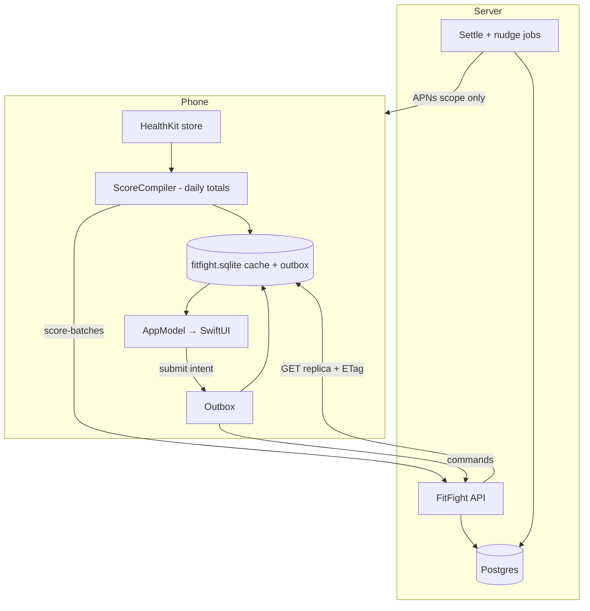

# FitFight system design

Marc asked for the whole stack, A–Z, as the app will look in 6–9 months — not a rewrite of today’s fixtures.

**Today:** one in-memory `AppModel` of fake people. No HealthKit, no server, no cache.
**Target:** friends in a real fight, scores from Apple Health, the server holding the clock and the money, the phone staying useful when killed or offline.

Eight review passes ran overnight (HealthKit ingest, Postgres, money/App Store, sync/cache, 6–9 month product, privacy/auth, Swift layers, regret). Agreement and leftover fights are in [`reviews.md`](reviews.md). This folder is the **resolved** design.

## Read in this order

| File | What it is |
| --- | --- |
| This page | Map, non-negotiables, current → future |
| [`decisions.md`](decisions.md) | Picks we will still like in nine months |
| [`layers.md`](layers.md) | Types + **SoD** (source of data) from raw HealthKit to a card |
| [`domain.md`](domain.md) | Fight lifecycle, settlement maths, money as IOU |
| [`schema.md`](schema.md) | Postgres |
| [`ingest.md`](ingest.md) | HealthKit compile, Strava later, no double-count |
| [`../sync.md`](../sync.md) | Phone GRDB cache, outbox, refresh (law) |
| [`api.md`](api.md) | HTTP, what the client may not send |
| [`ios.md`](ios.md) | Folders, `AppModel` façade, fixtures |
| [`../security.md`](../security.md) | SIWA, minimization, abuse |
| [`roadmap.md`](roadmap.md) | Build order. Later features hook in; they do not reshape v1 |

## Non-negotiables

1. **The server owns time, membership, scores, settlement.** A killed iPhone cannot end a month.
2. **HealthKit owns the body.** Raw samples never enter our sqlite, API logs, iCloud, or a push. The phone uploads **daily totals** for fights the user is in.
3. **Money is an IOU ledger among friends**, integer cents, no rails in v1. FitFight does not hold, send, or guarantee cash.
4. **Views do not invent numbers.** Kickers, `projectedNet`, rank, “SAFE” are formatted from projections. They are not columns.
5. **One write path on the phone.** Views call `AppModel.submit`. Only `SyncEngine` talks to the network. Only `ScoreCompiler` imports HealthKit. GRDB, not SwiftData, not CloudKit.
6. **Design variants stay data-blind.** Eleven Fights looks, one presented model.

## Picture

## What today’s mock is lying about

The `Fight` struct in `AppModel.swift` is a **screenshot of a card**, not an entity.

| Mock field | Truth |
| --- | --- |
| `status == invited` | Viewer membership. The fight can be live without you. |
| `pot` | `buy_in × accepted members`. Recalculate. Never a write column as source of truth. |
| `projectedNet`, `rank`, `daysLeft` | Projection from scores + clock. Recompute. |
| `kicker*`, `listSubtitle`, `payoutLine` | Copy. Presenter. |
| `code = FIGHT-742` | Fixture. Production codes are unguessable (`FF-XXXX-XXXX`). |
| `score: Double` | Integer native units (steps, seconds, counts). Money is cents. |

Fixtures stay, but they must enter through the **same writer** as the API (`CacheWriter`) or live only in `AppModel.preview()` for screenshots.

## Bounded contexts (6–9 months)

Keep them thin. Do not merge because one screen needs two.

| Context | Root | v1? |
| --- | --- | --- |
| Identity | `User` + Apple `sub` | yes |
| Fight | `Series?` + `Fight` + `Membership` | yes (`series_id` null) |
| Score | `ScoreDay` + ingest batch | yes |
| Stake | `Obligation` (IOU) | yes, honor-system |
| Notify | outbox + APNs | yes, invites + sync nudge |
| Feedback | Requests tab | yes, boring |
| Graph | `Block` | yes, before pokes |
| Safety | `Poke` / `Report` | later |
| Acquire | sticker token, sponsor credits | later, own tables |
| Dual | challenger vs backers + mass | later, `shape` already on `fights` |

Requests are **product feedback**, never fight invites.

## Stack (boring on purpose)

| Piece | Pick |
| --- | --- |
| Phone | SwiftUI, `@Observable` / `ObservableObject` façade, GRDB |
| Auth | Sign in with Apple → **our** session |
| API | One process, REST+JSON, `/v1` |
| DB | Postgres 16, private, EU if we can |
| Jobs | Same codebase: grace freeze, APNs drain |
| Realtime | None. Silent push = “refetch this scope” |

No Supabase-as-the-app, no SwiftData, no websocket, no IAP pots, no second login.

## Marc

This PR is **docs**. No TestFlight binary change. When we implement, a build will appear by itself after the code PR; open TestFlight → Update.

You will still need to flip Apple switches when code exists: Sign in with Apple, HealthKit, Push. An agent cannot do that.
