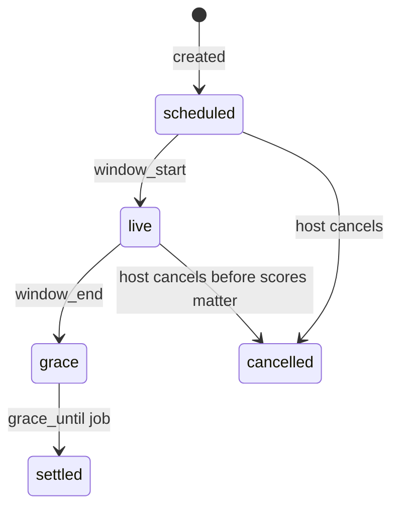

# Domain: fights, scores, settlement

Product copy in the mock is the spec. The fixture **numbers** are not: Derby nets do not sum to zero; 10K Club `+$7` is not “split the forfeits.” When the engine exists, regenerate fixtures from it.

## Fight lifecycle



| Status | Scores | UI |
| --- | --- | --- |
| `scheduled` | none | waiting |
| `live` | mutate on ingest | projections |
| `grace` | ingest if `sample_end < window_end` | still projections + “open to sync” |
| `settled` | frozen | settlement lines only |
| `cancelled` | ignore | buy-ins released |

The phone never local-timers `live → settled`.

**Window:** `window_start` / `window_end` are timestamptz. Civil days are `starts_on` … `ends_on` inclusive in `iana_timezone`.

**Grace (resolved):** until **next noon** in the fight timezone after `window_end`, hard cap **48h**. sync.md’s earlier “6 hours” is too tight for Watch catch-up. Job is idempotent.

**Who is in the pot:** `memberships.status = accepted` only. Invitees do not count. Accepting mid-fight recomputes pot (the mock bug).

## Membership

```
invited → accepted | declined
accepted → left | kicked
```

v1 roles: `racer` only. `challenger` / `backer` exist on the enum for dual later; unused.

Leave during `live`: product-undecided. Schema allows `left`; do not ship UI until Marc says. Suggest: bragging can leave; money fights cannot silently walk the pot.

## Stake

Sum type, not “dollars on Fight”:

- `none` — bragging. No ledger.
- `money_iou` — `buy_in_minor` cents, currency on the fight.
- `action` — free-text forfeit. **Proportional is hidden** (already in New fight). Settlement = one loser performs it (last place), not N−1 dinners.
- `credit` — later, sponsor. Not mixed into peer cents.

Ties (v1): winner mode splits the pot among tied leaders (Hamilton). Goal mode: nobody hits → even; everybody hits → even. No house.

## Settlement = one function, two clocks

```
projected = settle(rules, pace(scores, now))    // view
final     = settle(rules, freeze.scores)        // once, persist forever
```

Client must not `POST projected_net`. Zero-sum: `sum(net_cents) == 0`.

**Pace (live only):**

```
elapsed_days = max(fractional days since window_start, ε)
projected_score = score * length_days / elapsed_days
```

Finished: `projected_score = score`. Invited (not accepted): omitted.

### Winner takes all

Leader `+(n−1)*buy_in`, everyone else `−buy_in`. Live uses projected scores so the header matches “if it ends like this.” Freeze uses actual totals.

### Proportional

```
payout_i = hamilton(score_i / sum, pot_cents)
net_i    = payout_i - buy_in
```

`sum == 0` → even. Copy “60% of the steps → 60% of the pot” is the rule; “60% pays $30” is 60% of a $50 pot.

### Goal (“hit your goal”)

v1 is **window total**, not seven independent daily hits:

```
target = daily_goal * length_days
hit    = score_for_rule >= target
  live:  score_for_rule = projected_score   // current avg >= daily_goal
  final: score_for_rule = actual total
```

Missers `−buy_in`. Hitters split `missers * buy_in` equally (keep own stake). 10K Club fixture should be **+$20 / −$20** for 2 miss × $20 / 2 hit, not +7.

UI: live = projection (header “if it ends like this”, Money “if nothing changes”). Finished = frozen lines. Never mix.

Per-person goals: data model allows `memberships.daily_goal_milli`; create UI ships one shared goal (Ask first).

## Late HealthKit

| Phase | Accept samples with start < window_end? | Settlement |
| --- | --- | --- |
| live | yes | projection |
| grace | yes | projection; nudge push |
| after grace_until | no | frozen |

Missing upload = last accepted days, or **unscored** if *no* successful batch in the window (refund buy-in). Never wait for a killed phone. Never reopen because they opened the app on day 12.

## Recurring later

`fights.series` + `fights.occurrence_index`. A new **row**, not an UPDATE of history. Next window starts after previous freeze, not by mutating `ends_on`. Roster is an invite list, not auto-charge.

## Dual later

Separate shape `dual`. Not `Fight.kind` JSON. Shares Score + Stake. Backers are not racers. Default miss path: **refund backers**. Challenger-pays is a betting-market shape — schema enum exists, product off.

## Sponsors / stickers later

Stickers mint `JoinToken` → invite. Credits are `CreditGrant` to an account, **not** USD in the peer pot. Mixing credits into `buy_in` is how the ledger rots.
